Variabilidade espaçotemporal da emissão de GEE e a pecuária Brasileira
================
Oliveira PHM; Panosso AR
2024-03-28

# [Pré-processamento Xco2](https://arpanosso.github.io/pibic-pedro-oliveira/Docs/pre-processamento-xco2.html)

# Análise Para XCO2

## Carregando Pacotes

``` r
# ### Pacotes necessários
library(tidyverse)
library(ggridges)
library(geobr)
source("r/my-function.R")
```

    ## Polygons loaded [states, biomes, conservarion and indigenous]
    ## List of polygons loaded [list_pol]

## Filtrando a Base

``` r
### Base de dados inicial
data_set <- read_rds("data/nasa-xco2.rds") |> 
  filter(year >= 2015 & year <= 2020) |> 
  mutate(
    state = ifelse(state=="DF","GO",state)
  ) |> 
  select(-flag_nordeste, -flag_br)
glimpse(data_set)
```

    ## Rows: 1,135,303
    ## Columns: 12
    ## $ longitude         <dbl> -50.28787, -50.34569, -50.35614, -50.35908, -50.3602…
    ## $ latitude          <dbl> -12.87398, -12.67460, -12.65862, -12.62923, -12.6399…
    ## $ time              <dbl> 1420131440, 1420131444, 1420131445, 1420131445, 1420…
    ## $ date              <date> 2015-01-01, 2015-01-01, 2015-01-01, 2015-01-01, 201…
    ## $ year              <dbl> 2015, 2015, 2015, 2015, 2015, 2015, 2015, 2015, 2015…
    ## $ month             <dbl> 1, 1, 1, 1, 1, 1, 1, 1, 1, 1, 1, 1, 1, 1, 1, 1, 1, 1…
    ## $ day               <int> 1, 1, 1, 1, 1, 1, 1, 1, 1, 1, 1, 1, 1, 1, 1, 1, 1, 1…
    ## $ xco2              <dbl> 396.6765, 396.2824, 394.5461, 396.7095, 397.1642, 39…
    ## $ xco2_quality_flag <int> 0, 0, 0, 0, 0, 0, 0, 0, 0, 0, 0, 0, 0, 0, 0, 0, 0, 0…
    ## $ xco2_incerteza    <dbl> 0.5534429, 0.5050880, 0.6011925, 0.5258151, 0.549804…
    ## $ path              <chr> "oco2_LtCO2_150101_B11100Ar_230524221540s.nc4", "oco…
    ## $ state             <chr> "GO", "GO", "GO", "GO", "GO", "GO", "GO", "MT", "MT"…

### Plotando os pontos

``` r
data_set |>
  sample_n(1000) |> 
  filter(year == 2019) |>
  ggplot(aes(x = longitude, latitude)) +
  geom_point()
```

<!-- -->

``` r
# ## Avaliando o sinal de XCO2
#Carrega a base filtrada
data_set_me <- data_set |>
  filter( 
    state %in% c("MG","MT","MS","GO","PA")
  )
# Resumo da base
glimpse(data_set_me)
```

    ## Rows: 415,559
    ## Columns: 12
    ## $ longitude         <dbl> -50.28787, -50.34569, -50.35614, -50.35908, -50.3602…
    ## $ latitude          <dbl> -12.87398, -12.67460, -12.65862, -12.62923, -12.6399…
    ## $ time              <dbl> 1420131440, 1420131444, 1420131445, 1420131445, 1420…
    ## $ date              <date> 2015-01-01, 2015-01-01, 2015-01-01, 2015-01-01, 201…
    ## $ year              <dbl> 2015, 2015, 2015, 2015, 2015, 2015, 2015, 2015, 2015…
    ## $ month             <dbl> 1, 1, 1, 1, 1, 1, 1, 1, 1, 1, 1, 1, 1, 1, 1, 1, 1, 1…
    ## $ day               <int> 1, 1, 1, 1, 1, 1, 1, 1, 1, 1, 1, 1, 1, 1, 1, 1, 1, 1…
    ## $ xco2              <dbl> 396.6765, 396.2824, 394.5461, 396.7095, 397.1642, 39…
    ## $ xco2_quality_flag <int> 0, 0, 0, 0, 0, 0, 0, 0, 0, 0, 0, 0, 0, 0, 0, 0, 0, 0…
    ## $ xco2_incerteza    <dbl> 0.5534429, 0.5050880, 0.6011925, 0.5258151, 0.549804…
    ## $ path              <chr> "oco2_LtCO2_150101_B11100Ar_230524221540s.nc4", "oco…
    ## $ state             <chr> "GO", "GO", "GO", "GO", "GO", "GO", "GO", "MT", "MT"…

``` r
data_set_me |>
  filter(year == 2015) |>
  sample_n(1000) |> 
  ggplot(aes(x = longitude, latitude)) +
  geom_point()
```

<!-- -->

``` r
#Gráficos
# Histogramas
data_set_me %>%
  ggplot(aes(x=xco2)) +
  geom_histogram(color="black",fill="gray",
                 bins = 30) +
  facet_wrap(~year, scales = "free") +
  theme_bw()
```

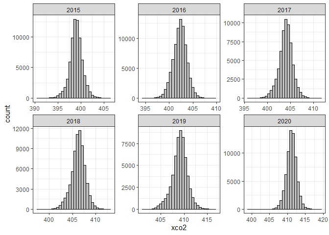<!-- -->

``` r
data_set_me %>%
  mutate(
  fct_year = fct_rev(as.factor(year)),
  ) %>%
  ggplot(aes(y=fct_year)) +
  geom_density_ridges(rel_min_height = 0.03,
                      aes(x=xco2, fill=state),
                      alpha = .6, color = "black"
  ) +
  scale_fill_viridis_d() +
  theme_ridges() +
  theme(
    legend.position = "top"
  )
```

<!-- -->

``` r
#Estatística Descritiva
data_set_me |>
  group_by(year,state) |>
  summarise(
    N = length(xco2),
    MIN = min(xco2),
    MEAN = mean(xco2),
    MEDIAN = median(xco2),
    MAX = max(xco2),
    VARIANCIA  = var(xco2),
    STD_DV = sd(xco2),
    CV = 100*STD_DV/MEAN,
    SKW = agricolae::skewness(xco2),
    KRT = agricolae::kurtosis(xco2),
  ) |>
  writexl::write_xlsx("output/estat-desc-xco2.xlsx")
```

## Análise Geoestatística

### PASSO 1

``` r
my_year = 2015
my_state = "PA"
# Criar o adensamento de pontos
x<-data_set_me$longitude
y<-data_set_me$latitude
dis <- 0.05 #Distância entre pontos
grid <- expand.grid(X=seq(min(x),max(x),dis), Y=seq(min(y),max(y),dis)) |>
  mutate(
    flag_my_state = my_state,
    flag_st = def_pol(X, Y, list_pol[[my_state]]),
    flag_df = def_pol(X, Y, list_pol[["DF"]]),
    flag = ifelse(flag_my_state == "GO", (flag_st|flag_df),flag_st)
  ) |>  filter(flag) |>
  dplyr::select(-starts_with("flag"))
sp::gridded(grid) = ~ X + Y
# plot(grid$X,grid$Y,col="red",pch=4)
# points(x,y)
```

### Agregação dos dados

``` r
dist_agg <- .15 #Distância entre pontos
grid_agg <- expand.grid(
  X=seq(min(x),max(x),dist_agg), 
  Y=seq(min(y),max(y),dist_agg)) |>
  mutate(
    flag_my_state = my_state,
    flag_st = def_pol(X, Y, list_pol[[my_state]]),
    flag_df = def_pol(X, Y, list_pol[["DF"]]),
    flag = ifelse(flag_my_state == "GO", (flag_st|flag_df),flag_st)
  ) |>  filter(flag) |>
  dplyr::select(-starts_with("flag"))

data_set_me |>
  filter(year == 2015,state == my_state) |> 
  ggplot(aes(longitude,latitude)) +
  geom_point() +
  geom_point(data=grid_agg, aes(X,Y))
```

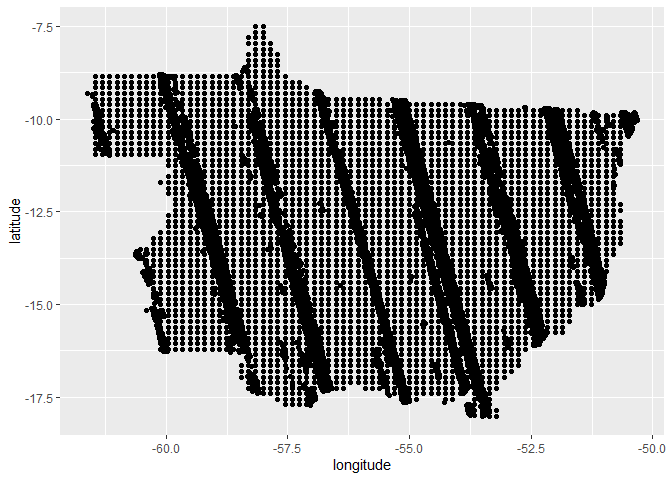<!-- -->

``` r
# Isolando o banco de dados, pelo ano
data_set_aux  <- data_set_me |>
  filter(
    year == my_year,
    state == my_state) |>
  dplyr::select(longitude, latitude, xco2)

vct_xco2 <- vector();dist_xco2 <- vector();
lon_grid <- vector();lat_grid <- vector();
for(i in 1:nrow(data_set_aux)){
  d <- sqrt((data_set_aux$longitude[i] - grid_agg$X)^2 + 
              (data_set_aux$lat[i] - grid_agg$Y)^2
  )
  min_index <- order(d)[1]
  vct_xco2[i] <- data_set_aux$xco2[min_index]
  dist_xco2[i] <- d[order(d)[1]]
  lon_grid[i] <- grid_agg$X[min_index]
  lat_grid[i] <- grid_agg$Y[min_index]
}
data_set_aux$dist_xco2 <- dist_xco2
data_set_aux$xco2_new <- vct_xco2
data_set_aux$lon_grid <- lon_grid
data_set_aux$lat_grid <- lat_grid
data_set_aux |> 
  group_by(lon_grid,lat_grid) |> 
  summarise(
    xco2 = mean(xco2)
  ) |> 
  rename(longitude = lon_grid, latitude = lat_grid) -> data_set_aux
```

### PASSO 2 - Construção do Semivariograma Experimental

``` r
# Alteração no df
sp::coordinates(data_set_aux) = ~ longitude + latitude

# Fórmule é a variável que modelar, e o 1 da fórmula indica que ela
# não sofre transformação
form <- xco2 ~ 1
```

``` r
# Criando o Semivariograma Experimental.
vari_exp <- gstat::variogram(form, data = data_set_aux,
                      cressie = FALSE,
                      cutoff = 3, # distância máxima do semivariograma
                      width = .1) # distancia entre pontos
vari_exp  %>%
  ggplot(aes(x=dist, y=gamma)) +
  geom_point() +
  labs(x="lag (º)",
       y=expression(paste(gamma,"(h)")))
```

<!-- -->

### Passo 3 - Ajuste dos modelos

``` r
patamar=1.8
alcance=.35
epepita=1
modelo_1 <- gstat::fit.variogram(vari_exp,gstat::vgm(patamar,"Sph",alcance,epepita))
modelo_2 <- gstat::fit.variogram(vari_exp,gstat::vgm(patamar,"Exp",alcance,epepita))
modelo_3 <- gstat::fit.variogram(vari_exp,gstat::vgm(patamar,"Gau",alcance,epepita))
sqr.f1<-round(attr(modelo_1, "SSErr"),4); c01<-round(modelo_1$psill[[1]],4); c0_c11<-round(sum(modelo_1$psill),4);a1<-round(modelo_1$range[[2]],2)
sqr.f2<-round(attr(modelo_2, "SSErr"),4); c02<-round(modelo_2$psill[[1]],4); c0_c12<-round(sum(modelo_2$psill),4);a2<-round(3*modelo_2$range[[2]],2)
sqr.f3<-round(attr(modelo_3, "SSErr"),4); c03<-round(modelo_3$psill[[1]],4); c0_c13<-round(sum(modelo_3$psill),4);a3<-round(modelo_3$range[[2]]*(3^.5),2)

df_aux <- vari_exp %>%
  mutate(
    gamma_m1 = ifelse(dist <= a1, c01 + (c0_c11-c01)*(3/2*(dist/a1)-1/2*(dist/a1)^3),c0_c11),
    gamma_m2 = c02 + (c0_c12-c02)*(1-exp(-3*(dist/a2))),
    gamma_m3 = c03 + (c0_c13-c03)*(1-exp(-3*(dist/a3)^2)),
    residuo_total = (gamma-mean(gamma))^2,
    residuo_mod_1 = (gamma - gamma_m1)^2,
    residuo_mod_2 = (gamma - gamma_m2)^2,
    residuo_mod_3 = (gamma - gamma_m3)^2
  ) %>%
  summarise(
    r2_1=(sum(residuo_total) - sum(residuo_mod_1))/sum(residuo_total),
    r2_2=(sum(residuo_total) - sum(residuo_mod_2))/sum(residuo_total),
    r2_3=(sum(residuo_total) - sum(residuo_mod_3))/sum(residuo_total),
  )
r21<-as.vector(round(df_aux[1],4))
r22<-as.vector(round(df_aux[2],4))
r23<-as.vector(round(df_aux[3],4))

plot(vari_exp,
     model=modelo_1,
     col=1,pl=F,
     pch=16,
     cex=1.2,cex.main=7,
     ylab=list("Semivariância",cex=1.3),
     xlab=list("Distância de Separação h (m)",cex=1.3),
     main =paste("Esf(C0= ",c01,"; C0+C1= ",
                 c0_c11, "; a= ", a1,"; r2 = ",
                 r21,")",sep=""))
```

<!-- -->

``` r
plot(vari_exp,model=modelo_2, col=1,pl=F,pch=16,cex=1.2,cex.main=7,ylab=list("Semivariância",cex=1.3),xlab=list("Distância de Separação h (m)",cex=1.3),main =paste("Exp(C0= ",c02,"; C0+C1= ", c0_c12, "; a= ", a2,"; r2 = ", r22,")",sep=""))
```

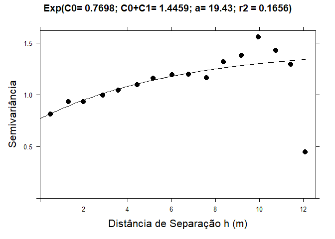<!-- -->

``` r
plot(vari_exp,model=modelo_3, col=1,pl=F,pch=16,cex=1.2,cex.main=7,ylab=list("Semivariância",cex=1.3),xlab=list("Distância de Separação h (m)",cex=1.3),main =paste("Gau(C0= ",c03,"; C0+C1= ", c0_c13, "; a= ", a3,"; r2 = ", r23,")",sep=""))
```

<!-- -->

### Passo 4 - escolha do melhor modelo

``` r
# LOOCV - Leave one out cross validation
conjunto_validacao <- data_set_aux %>%
  as_tibble() %>%
  sample_n(50)
sp::coordinates(conjunto_validacao) = ~longitude + latitude
modelos<-list(modelo_1,modelo_2,modelo_3)
for(j in 1:3){
  est<-0
  for(i in 1:nrow(conjunto_validacao)){
    valid <- gstat::krige(formula=form, conjunto_validacao[-i,], conjunto_validacao, model=modelos[[j]])
    est[i]<-valid$var1.pred[i]
  }
  obs<-as.data.frame(conjunto_validacao)[,3]
  RMSE<-round((sum((obs-est)^2)/length(obs))^.5,3)
  mod<-lm(obs~est)
  b<-round(mod$coefficients[2],3)
  se<-round(summary(mod)$coefficients[4],3)
  r2<-round(summary(mod)$r.squared,3)
  a<-round(mod$coefficients[1],3)
  plot(est,obs,xlab="Estimado", ylab="Observado",pch=j,col="blue",
       main=paste("Modelo = ",modelos[[j]][2,1],"; Coef. Reg. = ", b, " (SE = ",se, ", r2 = ", r2,")\ny intersept = ",a,"RMSE = ",RMSE ))
  abline(lm(obs~est));
  abline(0,1,lty=3)
}
```

    ## [using ordinary kriging]
    ## [using ordinary kriging]
    ## [using ordinary kriging]
    ## [using ordinary kriging]
    ## [using ordinary kriging]
    ## [using ordinary kriging]
    ## [using ordinary kriging]
    ## [using ordinary kriging]
    ## [using ordinary kriging]
    ## [using ordinary kriging]
    ## [using ordinary kriging]
    ## [using ordinary kriging]
    ## [using ordinary kriging]
    ## [using ordinary kriging]
    ## [using ordinary kriging]
    ## [using ordinary kriging]
    ## [using ordinary kriging]
    ## [using ordinary kriging]
    ## [using ordinary kriging]
    ## [using ordinary kriging]
    ## [using ordinary kriging]
    ## [using ordinary kriging]
    ## [using ordinary kriging]
    ## [using ordinary kriging]
    ## [using ordinary kriging]
    ## [using ordinary kriging]
    ## [using ordinary kriging]
    ## [using ordinary kriging]
    ## [using ordinary kriging]
    ## [using ordinary kriging]
    ## [using ordinary kriging]
    ## [using ordinary kriging]
    ## [using ordinary kriging]
    ## [using ordinary kriging]
    ## [using ordinary kriging]
    ## [using ordinary kriging]
    ## [using ordinary kriging]
    ## [using ordinary kriging]
    ## [using ordinary kriging]
    ## [using ordinary kriging]
    ## [using ordinary kriging]
    ## [using ordinary kriging]
    ## [using ordinary kriging]
    ## [using ordinary kriging]
    ## [using ordinary kriging]
    ## [using ordinary kriging]
    ## [using ordinary kriging]
    ## [using ordinary kriging]
    ## [using ordinary kriging]
    ## [using ordinary kriging]

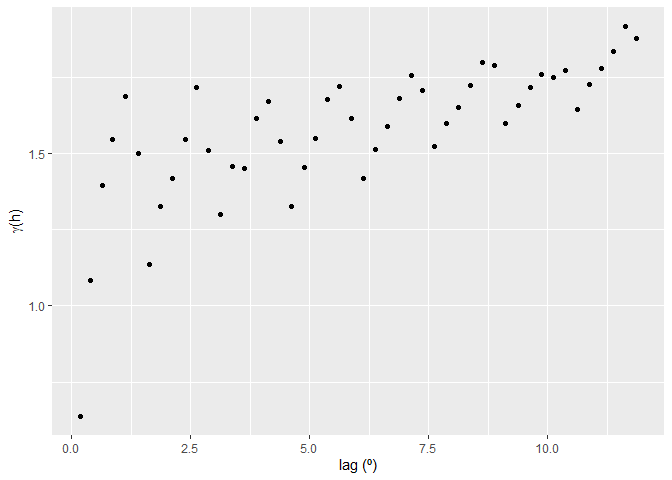<!-- -->

    ## [using ordinary kriging]
    ## [using ordinary kriging]
    ## [using ordinary kriging]
    ## [using ordinary kriging]
    ## [using ordinary kriging]
    ## [using ordinary kriging]
    ## [using ordinary kriging]
    ## [using ordinary kriging]
    ## [using ordinary kriging]
    ## [using ordinary kriging]
    ## [using ordinary kriging]
    ## [using ordinary kriging]
    ## [using ordinary kriging]
    ## [using ordinary kriging]
    ## [using ordinary kriging]
    ## [using ordinary kriging]
    ## [using ordinary kriging]
    ## [using ordinary kriging]
    ## [using ordinary kriging]
    ## [using ordinary kriging]
    ## [using ordinary kriging]
    ## [using ordinary kriging]
    ## [using ordinary kriging]
    ## [using ordinary kriging]
    ## [using ordinary kriging]
    ## [using ordinary kriging]
    ## [using ordinary kriging]
    ## [using ordinary kriging]
    ## [using ordinary kriging]
    ## [using ordinary kriging]
    ## [using ordinary kriging]
    ## [using ordinary kriging]
    ## [using ordinary kriging]
    ## [using ordinary kriging]
    ## [using ordinary kriging]
    ## [using ordinary kriging]
    ## [using ordinary kriging]
    ## [using ordinary kriging]
    ## [using ordinary kriging]
    ## [using ordinary kriging]
    ## [using ordinary kriging]
    ## [using ordinary kriging]
    ## [using ordinary kriging]
    ## [using ordinary kriging]
    ## [using ordinary kriging]
    ## [using ordinary kriging]
    ## [using ordinary kriging]
    ## [using ordinary kriging]
    ## [using ordinary kriging]
    ## [using ordinary kriging]

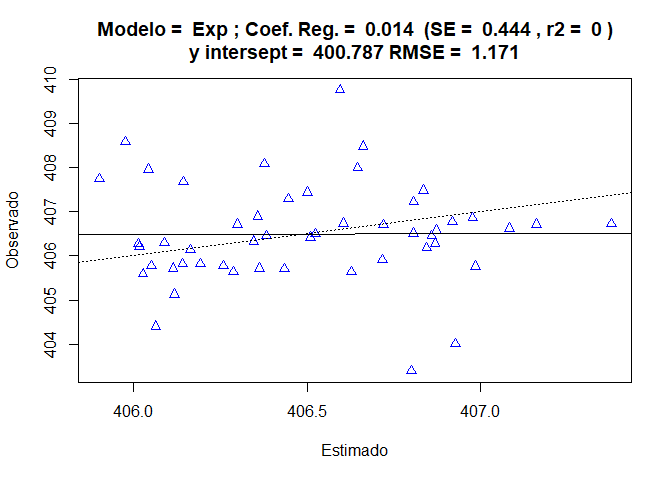<!-- -->

    ## [using ordinary kriging]
    ## [using ordinary kriging]
    ## [using ordinary kriging]
    ## [using ordinary kriging]
    ## [using ordinary kriging]
    ## [using ordinary kriging]
    ## [using ordinary kriging]
    ## [using ordinary kriging]
    ## [using ordinary kriging]
    ## [using ordinary kriging]
    ## [using ordinary kriging]
    ## [using ordinary kriging]
    ## [using ordinary kriging]
    ## [using ordinary kriging]
    ## [using ordinary kriging]
    ## [using ordinary kriging]
    ## [using ordinary kriging]
    ## [using ordinary kriging]
    ## [using ordinary kriging]
    ## [using ordinary kriging]
    ## [using ordinary kriging]
    ## [using ordinary kriging]
    ## [using ordinary kriging]
    ## [using ordinary kriging]
    ## [using ordinary kriging]
    ## [using ordinary kriging]
    ## [using ordinary kriging]
    ## [using ordinary kriging]
    ## [using ordinary kriging]
    ## [using ordinary kriging]
    ## [using ordinary kriging]
    ## [using ordinary kriging]
    ## [using ordinary kriging]
    ## [using ordinary kriging]
    ## [using ordinary kriging]
    ## [using ordinary kriging]
    ## [using ordinary kriging]
    ## [using ordinary kriging]
    ## [using ordinary kriging]
    ## [using ordinary kriging]
    ## [using ordinary kriging]
    ## [using ordinary kriging]
    ## [using ordinary kriging]
    ## [using ordinary kriging]
    ## [using ordinary kriging]
    ## [using ordinary kriging]
    ## [using ordinary kriging]
    ## [using ordinary kriging]
    ## [using ordinary kriging]
    ## [using ordinary kriging]

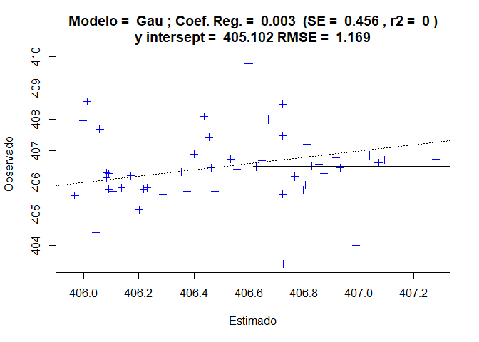<!-- -->

### Passo 5 - Selecionado o melhor modelo, vamos guardá-lo

``` r
modelo <- modelo_1 ## sempre modificar
# Salvando os parâmetros dos melhores modelo
model <- modelo |> slice(2) |> pull(model)
rss <- round(attr(modelo, "SSErr"),4) 
c0 <- round(modelo$psill[[1]],4) 
c0_c1 <- round(sum(modelo$psill),4)
a <- ifelse(model == "Gau", round(modelo$range[[2]]*(3^.5),2),
            ifelse(model == "Exp",round(3*modelo$range[[2]],2),
            round(modelo$range[[2]],2)))
r2 <- ifelse(model == "Gau", r23,
            ifelse(model == "Exp",r22,
            r21)) |> pluck(1)
tibble(
  my_state, my_year, model, c0, c0_c1, a, rss, r2
) |> mutate(gde = c0/c0_c1, .after = "a") |>
  rename(state=my_state,year=my_year) |> 
  write_csv(paste0("output/best-fit/",my_state,"-",my_year,"-xco2.csv"))

ls_csv <- list.files("output/best-fit/",full.names = TRUE,pattern = "-xco2.csv")
map_df(ls_csv, read_csv) |> 
  writexl::write_xlsx("output/semivariogram-models-xco2.xlsx")
png(filename = paste0("output/semivariogram-img/semivar-xco2-",
                      my_state,"-",my_year,".png"),
    width = 800, height = 600)
plot(vari_exp,model=modelo,cex.lab=2, col=1,pl=F,pch=16,cex=2.2,ylab=list("Semivariância",cex=2.3),xlab=list("Distância de Separação h (m)",cex=2.3,cex.axis=4))
dev.off()
```

    ## png 
    ##   2

### Passo 6 - Krigagem Ordinária - interpolação em locais não amostrados

``` r
ko_variavel <- gstat::krige(formula=form, data_set_aux, grid, model=modelo,
                     block=c(0.1,0.1),
                     nsim=0,
                     na.action=na.pass,
                     debug.level=-1
)
```

    ## [using ordinary kriging]
    ##   0% done  2% done  5% done  8% done 11% done 14% done 17% done 19% done 22% done 25% done 28% done 30% done 33% done 36% done 39% done 42% done 44% done 47% done 50% done 53% done 56% done 58% done 61% done 63% done 66% done 68% done 71% done 74% done 76% done 79% done 82% done 85% done 88% done 91% done 94% done 96% done 99% done100% done

## Passo 7 Visualização dos padrões espaciais e armazenamento dos dados e imagem.

``` r
mapa <- as.tibble(ko_variavel) %>%
  ggplot(aes(x=X, y=Y)) +
  geom_tile(aes(fill = var1.pred)) +
  scale_fill_viridis_c() +
  coord_equal() +
  labs(x="Longitude",
       y="Latitude",
       fill="xco2") +
  theme_bw()
mapa
```

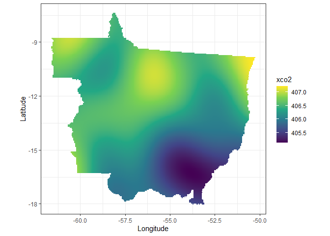<!-- -->

``` r
ggsave(paste0("output/maps-kgr/kgr-xco2-",my_state,"-",my_year,".png"), plot = mapa, width = 10, height = 8, dpi = 300)
df <- ko_variavel %>%
  as.tibble() %>%
  mutate(var1.var = sqrt(var1.var)) 
write_rds(df,paste0("output/maps-kgr/kgr-xco2-",my_state,"-",my_year,".rds"))
```

# Análise Para XCH4

## Carregando Pacotes

## Filtrando a Base

``` r
### Base de dados inicial
data_set <- read_rds("data/gosat-xch4.rds") |> 
  filter(year >= 2015 & year <= 2020) |> 
  mutate(
    state = ifelse(state=="DF","GO",state)
  ) |> 
  select(-flag_nordeste, -flag_br)
glimpse(data_set)
```

    ## Rows: 52,796
    ## Columns: 12
    ## $ longitude         <dbl> -50.55648, -50.55732, -52.16461, -52.16571, -52.1661…
    ## $ latitude          <dbl> 0.6428701, 0.6460943, -6.9492564, -6.9488077, -6.945…
    ## $ time              <dbl> 1422806474, 1422806479, 1422806571, 1422806576, 1422…
    ## $ date              <date> 2015-02-01, 2015-02-01, 2015-02-01, 2015-02-01, 201…
    ## $ year              <dbl> 2015, 2015, 2015, 2015, 2015, 2015, 2015, 2015, 2015…
    ## $ month             <dbl> 2, 2, 2, 2, 2, 2, 2, 2, 2, 2, 2, 2, 2, 2, 2, 2, 2, 2…
    ## $ day               <int> 1, 1, 1, 1, 1, 1, 1, 1, 1, 1, 1, 1, 1, 1, 1, 1, 1, 1…
    ## $ xch4              <dbl> 1834.315, 1842.071, 1840.691, 1826.608, 1834.456, 18…
    ## $ xch4_quality_flag <int> 0, 0, 0, 0, 0, 0, 0, 0, 0, 0, 0, 0, 0, 0, 0, 0, 0, 0…
    ## $ xch4_incerteza    <dbl> 9.699241, 9.678691, 10.075063, 9.945088, 9.987506, 1…
    ## $ path              <chr> "UoL-GHG-L2-CH4-GOSAT-OCPR-20150201-fv9.0.nc", "UoL-…
    ## $ state             <chr> "AP", "AP", "PA", "PA", "PA", "MT", "MT", "MT", "MT"…

``` r
# ## Avaliando o sinal de XCH4
#Carrega a base filtrada
data_set_me <- data_set |>
  filter( 
    state %in% c("MG","MT","MS","GO","PA")
  )
# Resumo da base
glimpse(data_set_me)
```

    ## Rows: 24,344
    ## Columns: 12
    ## $ longitude         <dbl> -52.16461, -52.16571, -52.16616, -50.32345, -50.3242…
    ## $ latitude          <dbl> -6.949256, -6.948808, -6.945048, -9.851810, -9.84787…
    ## $ time              <dbl> 1422806571, 1422806576, 1422806580, 1422806626, 1422…
    ## $ date              <date> 2015-02-01, 2015-02-01, 2015-02-01, 2015-02-01, 201…
    ## $ year              <dbl> 2015, 2015, 2015, 2015, 2015, 2015, 2015, 2015, 2015…
    ## $ month             <dbl> 2, 2, 2, 2, 2, 2, 2, 2, 2, 2, 2, 2, 2, 2, 2, 2, 2, 2…
    ## $ day               <int> 1, 1, 1, 1, 1, 1, 1, 1, 1, 1, 1, 1, 1, 1, 1, 1, 1, 1…
    ## $ xch4              <dbl> 1840.691, 1826.608, 1834.456, 1839.762, 1828.547, 18…
    ## $ xch4_quality_flag <int> 0, 0, 0, 0, 0, 0, 0, 0, 0, 0, 0, 0, 0, 0, 0, 0, 0, 0…
    ## $ xch4_incerteza    <dbl> 10.075063, 9.945088, 9.987506, 10.116740, 10.031814,…
    ## $ path              <chr> "UoL-GHG-L2-CH4-GOSAT-OCPR-20150201-fv9.0.nc", "UoL-…
    ## $ state             <chr> "PA", "PA", "PA", "MT", "MT", "MT", "MT", "MT", "MT"…

``` r
data_set_me |>
  filter(year == 2015) |>
  sample_n(1000) |> 
  ggplot(aes(x = longitude, latitude)) +
  geom_point()
```

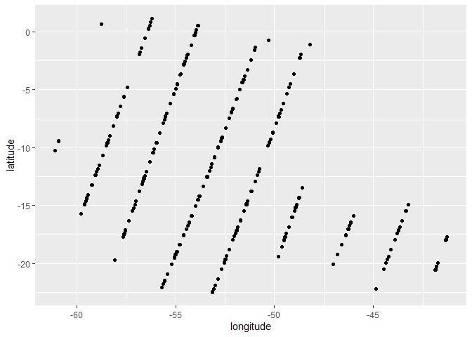<!-- -->

``` r
#Gráficos
# Histogramas
data_set_me %>%
  ggplot(aes(x=xch4)) +
  geom_histogram(color="black",fill="gray",
                 bins = 30) +
  facet_wrap(~year, scales = "free") +
  theme_bw()
```

<!-- -->

``` r
data_set_me %>%
  mutate(
  fct_year = fct_rev(as.factor(year)),
  ) %>%
  ggplot(aes(y=fct_year)) +
  geom_density_ridges(rel_min_height = 0.03,
                      aes(x=xch4, fill=state),
                      alpha = .6, color = "black"
  ) +
  scale_fill_viridis_d() +
  theme_ridges() +
  theme(
    legend.position = "top"
  )
```

<!-- -->

``` r
#Estatística Descritiva
data_set_me |>
  group_by(year,state) |>
  summarise(
    N = length(xch4),
    MIN = min(xch4),
    MEAN = mean(xch4),
    MEDIAN = median(xch4),
    MAX = max(xch4),
    VARIANCIA  = var(xch4),
    STD_DV = sd(xch4),
    CV = 100*STD_DV/MEAN,
    SKW = agricolae::skewness(xch4),
    KRT = agricolae::kurtosis(xch4),
  ) |>
  writexl::write_xlsx("output/estat-desc-xch4.xlsx")
```

## Análise Geoestatística

### PASSO 1

``` r
my_year = 2015
my_state = "PA"
# Criar o adensamento de pontos
x<-data_set_me$longitude
y<-data_set_me$latitude
dis <- 0.05 #Distância entre pontos
grid <- expand.grid(X=seq(min(x),max(x),dis), Y=seq(min(y),max(y),dis)) |>
  mutate(
    flag_my_state = my_state,
    flag_st = def_pol(X, Y, list_pol[[my_state]]),
    flag_df = def_pol(X, Y, list_pol[["DF"]]),
    flag = ifelse(flag_my_state == "GO", (flag_st|flag_df),flag_st)
  ) |>  filter(flag) |>
  dplyr::select(-starts_with("flag"))
sp::gridded(grid) = ~ X + Y
# plot(grid$X,grid$Y,col="red",pch=4)
# points(x,y)
```

### Agregação dos dados

``` r
dist_agg <- .15 #Distância entre pontos
grid_agg <- expand.grid(
  X=seq(min(x),max(x),dist_agg), 
  Y=seq(min(y),max(y),dist_agg)) |>
  mutate(
    flag_my_state = my_state,
    flag_st = def_pol(X, Y, list_pol[[my_state]]),
    flag_df = def_pol(X, Y, list_pol[["DF"]]),
    flag = ifelse(flag_my_state == "GO", (flag_st|flag_df),flag_st)
  ) |>  filter(flag) |>
  dplyr::select(-starts_with("flag"))

data_set_me |>
  filter(year == 2015,state == my_state) |> 
  ggplot(aes(longitude,latitude)) +
  geom_point() +
  geom_point(data=grid_agg, aes(X,Y))
```

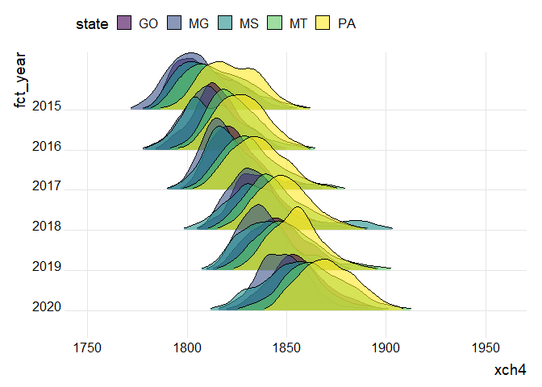<!-- -->

``` r
# Isolando o banco de dados, pelo ano
data_set_aux  <- data_set_me |>
  filter(
    year == my_year,
    state == my_state) |>
  dplyr::select(longitude, latitude, xch4)

# vct_xch4 <- vector();dist_xch4 <- vector();
# lon_grid <- vector();lat_grid <- vector();
# for(i in 1:nrow(data_set_aux)){
#   d <- sqrt((data_set_aux$longitude[i] - grid_agg$X)^2 + 
#               (data_set_aux$lat[i] - grid_agg$Y)^2
#   )
#   min_index <- order(d)[1]
#   vct_xch4[i] <- data_set_aux$xch4[min_index]
#   dist_xch4[i] <- d[order(d)[1]]
#   lon_grid[i] <- grid_agg$X[min_index]
#   lat_grid[i] <- grid_agg$Y[min_index]
# }
# data_set_aux$dist_xch4 <- dist_xch4
# data_set_aux$xch4_new <- vct_xch4
# data_set_aux$lon_grid <- lon_grid
# data_set_aux$lat_grid <- lat_grid
# data_set_aux |> 
#   group_by(lon_grid,lat_grid) |> 
#   summarise(
#     xch4 = mean(xch4)
#   ) |> 
#   rename(longitude = lon_grid, latitude = lat_grid) -> data_set_aux
```

### PASSO 2 - Construção do Semivariograma Experimental

``` r
# Alteração no df
sp::coordinates(data_set_aux) = ~ longitude + latitude

# Fórmule é a variável que modelar, e o 1 da fórmula indica que ela
# não sofre transformação
form <- xch4 ~ 1
```

``` r
# Criando o Semivariograma Experimental.
vari_exp <- gstat::variogram(form, data = data_set_aux,
                      cressie = FALSE,
                      cutoff = 10, # distância máxima do semivariograma
                      width = .18) # distancia entre pontos
vari_exp  %>%
  ggplot(aes(x=dist, y=gamma)) +
  geom_point() +
  labs(x="lag (º)",
       y=expression(paste(gamma,"(h)")))
```

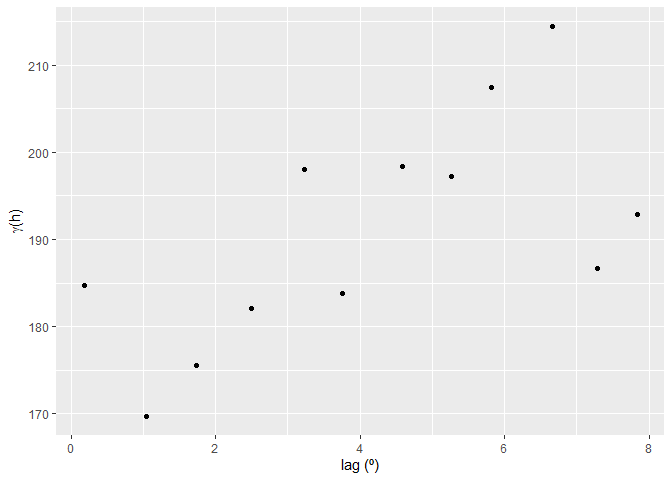<!-- -->

### Passo 3 - Ajuste dos modelos

``` r
patamar=400
alcance=2
epepita=1
modelo_1 <- gstat::fit.variogram(vari_exp,gstat::vgm(patamar,"Sph",alcance,epepita))
modelo_2 <- gstat::fit.variogram(vari_exp,gstat::vgm(patamar,"Exp",alcance,epepita))
modelo_3 <- gstat::fit.variogram(vari_exp,gstat::vgm(patamar,"Gau",alcance,epepita))
sqr.f1<-round(attr(modelo_1, "SSErr"),4); c01<-round(modelo_1$psill[[1]],4); c0_c11<-round(sum(modelo_1$psill),4);a1<-round(modelo_1$range[[2]],2)
sqr.f2<-round(attr(modelo_2, "SSErr"),4); c02<-round(modelo_2$psill[[1]],4); c0_c12<-round(sum(modelo_2$psill),4);a2<-round(3*modelo_2$range[[2]],2)
sqr.f3<-round(attr(modelo_3, "SSErr"),4); c03<-round(modelo_3$psill[[1]],4); c0_c13<-round(sum(modelo_3$psill),4);a3<-round(modelo_3$range[[2]]*(3^.5),2)

df_aux <- vari_exp %>%
  mutate(
    gamma_m1 = ifelse(dist <= a1, c01 + (c0_c11-c01)*(3/2*(dist/a1)-1/2*(dist/a1)^3),c0_c11),
    gamma_m2 = c02 + (c0_c12-c02)*(1-exp(-3*(dist/a2))),
    gamma_m3 = c03 + (c0_c13-c03)*(1-exp(-3*(dist/a3)^2)),
    residuo_total = (gamma-mean(gamma))^2,
    residuo_mod_1 = (gamma - gamma_m1)^2,
    residuo_mod_2 = (gamma - gamma_m2)^2,
    residuo_mod_3 = (gamma - gamma_m3)^2
  ) %>%
  summarise(
    r2_1=(sum(residuo_total) - sum(residuo_mod_1))/sum(residuo_total),
    r2_2=(sum(residuo_total) - sum(residuo_mod_2))/sum(residuo_total),
    r2_3=(sum(residuo_total) - sum(residuo_mod_3))/sum(residuo_total),
  )
r21<-as.vector(round(df_aux[1],4))
r22<-as.vector(round(df_aux[2],4))
r23<-as.vector(round(df_aux[3],4))

plot(vari_exp,
     model=modelo_1,
     col=1,pl=F,
     pch=16,
     cex=1.2,cex.main=7,
     ylab=list("Semivariância",cex=1.3),
     xlab=list("Distância de Separação h (m)",cex=1.3),
     main =paste("Esf(C0= ",c01,"; C0+C1= ",
                 c0_c11, "; a= ", a1,"; r2 = ",
                 r21,")",sep=""))
```

<!-- -->

``` r
plot(vari_exp,model=modelo_2, col=1,pl=F,pch=16,cex=1.2,cex.main=7,ylab=list("Semivariância",cex=1.3),xlab=list("Distância de Separação h (m)",cex=1.3),main =paste("Exp(C0= ",c02,"; C0+C1= ", c0_c12, "; a= ", a2,"; r2 = ", r22,")",sep=""))
```

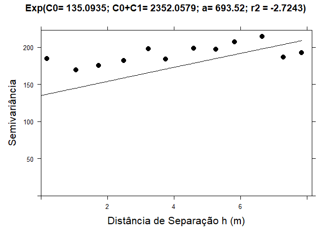<!-- -->

``` r
plot(vari_exp,model=modelo_3, col=1,pl=F,pch=16,cex=1.2,cex.main=7,ylab=list("Semivariância",cex=1.3),xlab=list("Distância de Separação h (m)",cex=1.3),main =paste("Gau(C0= ",c03,"; C0+C1= ", c0_c13, "; a= ", a3,"; r2 = ", r23,")",sep=""))
```

<!-- -->

### Passo 4 - escolha do melhor modelo

``` r
# LOOCV - Leave one out cross validation
conjunto_validacao <- data_set_aux %>%
  as_tibble() %>%
  sample_n(50)
sp::coordinates(conjunto_validacao) = ~longitude + latitude
modelos<-list(modelo_1,modelo_2,modelo_3)
for(j in 1:3){
  est<-0
  for(i in 1:nrow(conjunto_validacao)){
    valid <- gstat::krige(formula=form, conjunto_validacao[-i,], conjunto_validacao, model=modelos[[j]])
    est[i]<-valid$var1.pred[i]
  }
  obs<-as.data.frame(conjunto_validacao)[,3]
  RMSE<-round((sum((obs-est)^2)/length(obs))^.5,3)
  mod<-lm(obs~est)
  b<-round(mod$coefficients[2],3)
  se<-round(summary(mod)$coefficients[4],3)
  r2<-round(summary(mod)$r.squared,3)
  a<-round(mod$coefficients[1],3)
  plot(est,obs,xlab="Estimado", ylab="Observado",pch=j,col="blue",
       main=paste("Modelo = ",modelos[[j]][2,1],"; Coef. Reg. = ", b, " (SE = ",se, ", r2 = ", r2,")\ny intersept = ",a,"RMSE = ",RMSE ))
  abline(lm(obs~est));
  abline(0,1,lty=3)
}
```

    ## [using ordinary kriging]
    ## [using ordinary kriging]
    ## [using ordinary kriging]
    ## [using ordinary kriging]
    ## [using ordinary kriging]
    ## [using ordinary kriging]
    ## [using ordinary kriging]
    ## [using ordinary kriging]
    ## [using ordinary kriging]
    ## [using ordinary kriging]
    ## [using ordinary kriging]
    ## [using ordinary kriging]
    ## [using ordinary kriging]
    ## [using ordinary kriging]
    ## [using ordinary kriging]
    ## [using ordinary kriging]
    ## [using ordinary kriging]
    ## [using ordinary kriging]
    ## [using ordinary kriging]
    ## [using ordinary kriging]
    ## [using ordinary kriging]
    ## [using ordinary kriging]
    ## [using ordinary kriging]
    ## [using ordinary kriging]
    ## [using ordinary kriging]
    ## [using ordinary kriging]
    ## [using ordinary kriging]
    ## [using ordinary kriging]
    ## [using ordinary kriging]
    ## [using ordinary kriging]
    ## [using ordinary kriging]
    ## [using ordinary kriging]
    ## [using ordinary kriging]
    ## [using ordinary kriging]
    ## [using ordinary kriging]
    ## [using ordinary kriging]
    ## [using ordinary kriging]
    ## [using ordinary kriging]
    ## [using ordinary kriging]
    ## [using ordinary kriging]
    ## [using ordinary kriging]
    ## [using ordinary kriging]
    ## [using ordinary kriging]
    ## [using ordinary kriging]
    ## [using ordinary kriging]
    ## [using ordinary kriging]
    ## [using ordinary kriging]
    ## [using ordinary kriging]
    ## [using ordinary kriging]
    ## [using ordinary kriging]

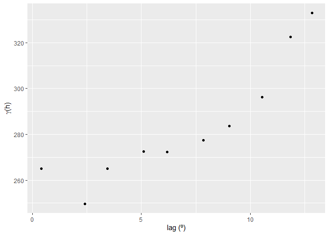<!-- -->

    ## [using ordinary kriging]
    ## [using ordinary kriging]
    ## [using ordinary kriging]
    ## [using ordinary kriging]
    ## [using ordinary kriging]
    ## [using ordinary kriging]
    ## [using ordinary kriging]
    ## [using ordinary kriging]
    ## [using ordinary kriging]
    ## [using ordinary kriging]
    ## [using ordinary kriging]
    ## [using ordinary kriging]
    ## [using ordinary kriging]
    ## [using ordinary kriging]
    ## [using ordinary kriging]
    ## [using ordinary kriging]
    ## [using ordinary kriging]
    ## [using ordinary kriging]
    ## [using ordinary kriging]
    ## [using ordinary kriging]
    ## [using ordinary kriging]
    ## [using ordinary kriging]
    ## [using ordinary kriging]
    ## [using ordinary kriging]
    ## [using ordinary kriging]
    ## [using ordinary kriging]
    ## [using ordinary kriging]
    ## [using ordinary kriging]
    ## [using ordinary kriging]
    ## [using ordinary kriging]
    ## [using ordinary kriging]
    ## [using ordinary kriging]
    ## [using ordinary kriging]
    ## [using ordinary kriging]
    ## [using ordinary kriging]
    ## [using ordinary kriging]
    ## [using ordinary kriging]
    ## [using ordinary kriging]
    ## [using ordinary kriging]
    ## [using ordinary kriging]
    ## [using ordinary kriging]
    ## [using ordinary kriging]
    ## [using ordinary kriging]
    ## [using ordinary kriging]
    ## [using ordinary kriging]
    ## [using ordinary kriging]
    ## [using ordinary kriging]
    ## [using ordinary kriging]
    ## [using ordinary kriging]
    ## [using ordinary kriging]

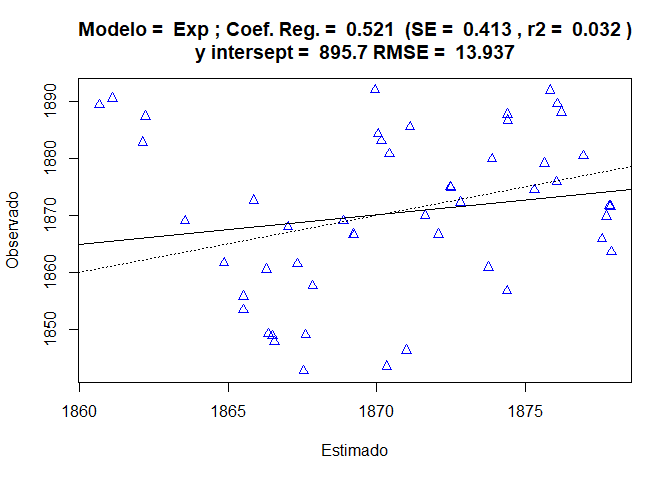<!-- -->

    ## [using ordinary kriging]
    ## [using ordinary kriging]
    ## [using ordinary kriging]
    ## [using ordinary kriging]
    ## [using ordinary kriging]
    ## [using ordinary kriging]
    ## [using ordinary kriging]
    ## [using ordinary kriging]
    ## [using ordinary kriging]
    ## [using ordinary kriging]
    ## [using ordinary kriging]
    ## [using ordinary kriging]
    ## [using ordinary kriging]
    ## [using ordinary kriging]
    ## [using ordinary kriging]
    ## [using ordinary kriging]
    ## [using ordinary kriging]
    ## [using ordinary kriging]
    ## [using ordinary kriging]
    ## [using ordinary kriging]
    ## [using ordinary kriging]
    ## [using ordinary kriging]
    ## [using ordinary kriging]
    ## [using ordinary kriging]
    ## [using ordinary kriging]
    ## [using ordinary kriging]
    ## [using ordinary kriging]
    ## [using ordinary kriging]
    ## [using ordinary kriging]
    ## [using ordinary kriging]
    ## [using ordinary kriging]
    ## [using ordinary kriging]
    ## [using ordinary kriging]
    ## [using ordinary kriging]
    ## [using ordinary kriging]
    ## [using ordinary kriging]
    ## [using ordinary kriging]
    ## [using ordinary kriging]
    ## [using ordinary kriging]
    ## [using ordinary kriging]
    ## [using ordinary kriging]
    ## [using ordinary kriging]
    ## [using ordinary kriging]
    ## [using ordinary kriging]
    ## [using ordinary kriging]
    ## [using ordinary kriging]
    ## [using ordinary kriging]
    ## [using ordinary kriging]
    ## [using ordinary kriging]
    ## [using ordinary kriging]

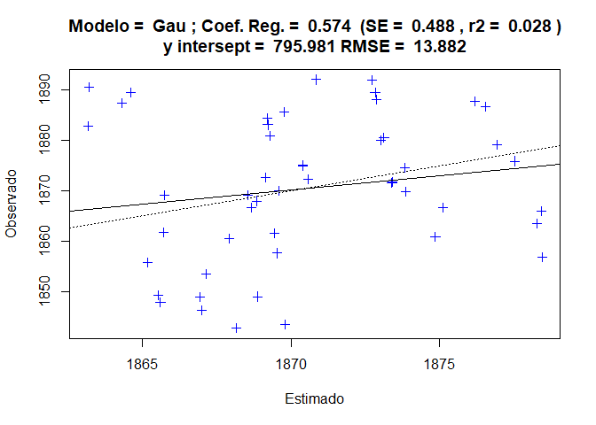<!-- -->

### Passo 5 - Selecionado o melhor modelo, vamos guardá-lo

``` r
modelo <- modelo_2 ## sempre modificar
# Salvando os parâmetros dos melhores modelo
model <- modelo |> slice(2) |> pull(model)
rss <- round(attr(modelo, "SSErr"),4) 
c0 <- round(modelo$psill[[1]],4) 
c0_c1 <- round(sum(modelo$psill),4)
a <- ifelse(model == "Gau", round(modelo$range[[2]]*(3^.5),2),
            ifelse(model == "Exp",round(3*modelo$range[[2]],2),
            round(modelo$range[[2]],2)))
r2 <- ifelse(model == "Gau", r23,
            ifelse(model == "Exp",r22,
            r21)) |> pluck(1)
tibble(
  my_state, my_year, model, c0, c0_c1, a, rss, r2
) |> mutate(gde = c0/c0_c1, .after = "a") |>
  rename(state=my_state,year=my_year) |> 
  write_csv(paste0("output/best-fit/",my_state,"-",my_year,"-xch4.csv"))

ls_csv <- list.files("output/best-fit/",full.names = TRUE,pattern = "-xch4.csv")
map_df(ls_csv, read_csv) |> 
  writexl::write_xlsx("output/semivariogram-models-xch4.xlsx")
png(filename = paste0("output/semivariogram-img/semivar-xch4-",
                      my_state,"-",my_year,".png"),
    width = 800, height = 600)
plot(vari_exp,model=modelo,cex.lab=2, col=1,pl=F,pch=16,cex=2.2,ylab=list("Semivariância",cex=2.3),xlab=list("Distância de Separação h (m)",cex=2.3,cex.axis=4))
dev.off()
```

    ## png 
    ##   2

### Passo 6 - Krigagem Ordinária - interpolação em locais não amostrados

``` r
ko_variavel <- gstat::krige(formula=form, data_set_aux, grid, model=modelo,
                     block=c(0.1,0.1),
                     nsim=0,
                     na.action=na.pass,
                     debug.level=-1
)
```

    ## [using ordinary kriging]
    ##   1% done  3% done  5% done  7% done 10% done 12% done 14% done 16% done 18% done 21% done 23% done 25% done 27% done 29% done 32% done 34% done 36% done 38% done 41% done 43% done 45% done 47% done 49% done 52% done 54% done 56% done 58% done 61% done 63% done 65% done 67% done 69% done 72% done 74% done 76% done 78% done 81% done 83% done 85% done 87% done 89% done 92% done 94% done 96% done 98% done100% done

## Passo 7 Visualização dos padrões espaciais e armazenamento dos dados e imagem.

``` r
mapa <- as.tibble(ko_variavel) %>%
  ggplot(aes(x=X, y=Y)) +
  geom_tile(aes(fill = var1.pred)) +
  scale_fill_viridis_c() +
  coord_equal() +
  labs(x="Longitude",
       y="Latitude",
       fill="xch4") +
  theme_bw()
mapa
```

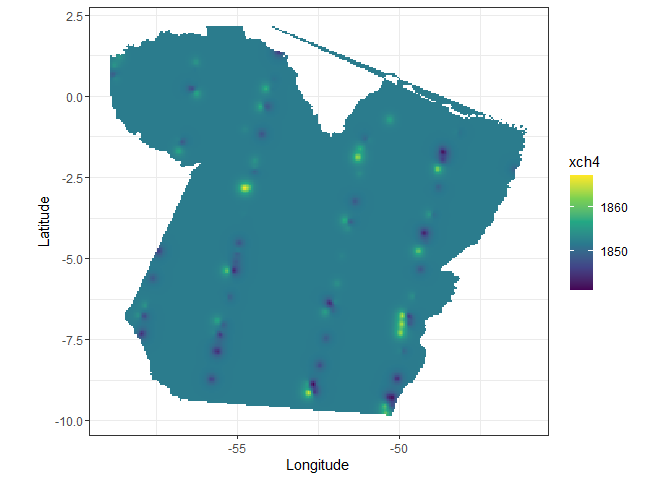<!-- -->

``` r
ggsave(paste0("output/maps-kgr/kgr-xch4-",my_state,"-",my_year,".png"), plot = mapa, width = 10, height = 8, dpi = 300)
df <- ko_variavel %>%
  as.tibble() %>%
  mutate(var1.var = sqrt(var1.var)) 
write_rds(df,paste0("output/maps-kgr/kgr-xch4-",my_state,"-",my_year,".rds"))
```

# Análise para SIF

## Carregando Pacotes

## Filtrando a Base

``` r
### Base de dados inicial
data_set <- read_rds("data/oco2-sif.rds") |> 
  filter(year >= 2015 & year <= 2020,
         sif >= -1 & sif <= 5) |> 
  mutate(
    state = ifelse(state=="DF","GO",state)
  ) |> 
  select(-flag_nordeste, -flag_br)
glimpse(data_set)
```

    ## Rows: 34,787
    ## Columns: 25
    ## $ longitude                                                     <dbl> -52.5, -…
    ## $ longitude_bnds                                                <chr> "-53.0:-…
    ## $ latitude                                                      <dbl> -4.5, -3…
    ## $ latitude_bnds                                                 <chr> "-5.0:-4…
    ## $ time_yyyymmddhhmmss                                           <dbl> 2.01501e…
    ## $ time_bnds_yyyymmddhhmmss                                      <chr> "2015010…
    ## $ altitude_km                                                   <dbl> 2955.042…
    ## $ alt_bnds_km                                                   <chr> "0.0:591…
    ## $ fluorescence_radiance_757nm_uncert_idp_ph_sec_1_m_2_sr_1_um_1 <dbl> 7.538797…
    ## $ fluorescence_radiance_757nm_idp_ph_sec_1_m_2_sr_1_um_1        <dbl> 2.977973…
    ## $ xco2_moles_mole_1                                             <dbl> 0.000393…
    ## $ aerosol_total_aod                                             <dbl> 0.157814…
    ## $ fluorescence_offset_relative_771nm_idp                        <dbl> 0.020921…
    ## $ fluorescence_at_reference_ph_sec_1_m_2_sr_1_um_1              <dbl> 4.183452…
    ## $ fluorescence_radiance_771nm_idp_ph_sec_1_m_2_sr_1_um_1        <dbl> 3.720872…
    ## $ fluorescence_offset_relative_757nm_idp                        <dbl> 0.016250…
    ## $ fluorescence_radiance_771nm_uncert_idp_ph_sec_1_m_2_sr_1_um_1 <dbl> 5.870890…
    ## $ XCO2                                                          <dbl> 385.1973…
    ## $ xco2                                                          <dbl> 393.0661…
    ## $ date                                                          <dttm> 2015-01…
    ## $ year                                                          <dbl> 2015, 20…
    ## $ month                                                         <dbl> 1, 1, 1,…
    ## $ day                                                           <int> 1, 1, 1,…
    ## $ sif                                                           <dbl> 1.110144…
    ## $ state                                                         <chr> "PA", "P…

``` r
# ## Avaliando o sinal de XCH4
#Carrega a base filtrada
data_set_me <- data_set |>
  filter( 
    state %in% c("MG","MT","MS","GO","PA")
  )
# Resumo da base
glimpse(data_set_me)
```

    ## Rows: 14,294
    ## Columns: 25
    ## $ longitude                                                     <dbl> -52.5, -…
    ## $ longitude_bnds                                                <chr> "-53.0:-…
    ## $ latitude                                                      <dbl> -4.5, -3…
    ## $ latitude_bnds                                                 <chr> "-5.0:-4…
    ## $ time_yyyymmddhhmmss                                           <dbl> 2.01501e…
    ## $ time_bnds_yyyymmddhhmmss                                      <chr> "2015010…
    ## $ altitude_km                                                   <dbl> 2955.042…
    ## $ alt_bnds_km                                                   <chr> "0.0:591…
    ## $ fluorescence_radiance_757nm_uncert_idp_ph_sec_1_m_2_sr_1_um_1 <dbl> 7.538797…
    ## $ fluorescence_radiance_757nm_idp_ph_sec_1_m_2_sr_1_um_1        <dbl> 2.977973…
    ## $ xco2_moles_mole_1                                             <dbl> 0.000393…
    ## $ aerosol_total_aod                                             <dbl> 0.157814…
    ## $ fluorescence_offset_relative_771nm_idp                        <dbl> 0.020921…
    ## $ fluorescence_at_reference_ph_sec_1_m_2_sr_1_um_1              <dbl> 4.183452…
    ## $ fluorescence_radiance_771nm_idp_ph_sec_1_m_2_sr_1_um_1        <dbl> 3.720872…
    ## $ fluorescence_offset_relative_757nm_idp                        <dbl> 0.016250…
    ## $ fluorescence_radiance_771nm_uncert_idp_ph_sec_1_m_2_sr_1_um_1 <dbl> 5.870890…
    ## $ XCO2                                                          <dbl> 385.1973…
    ## $ xco2                                                          <dbl> 393.0661…
    ## $ date                                                          <dttm> 2015-01…
    ## $ year                                                          <dbl> 2015, 20…
    ## $ month                                                         <dbl> 1, 1, 1,…
    ## $ day                                                           <int> 1, 1, 1,…
    ## $ sif                                                           <dbl> 1.110144…
    ## $ state                                                         <chr> "PA", "P…

``` r
data_set_me |>
  filter(year == 2015) |>
  sample_n(1000) |> 
  ggplot(aes(x = longitude, latitude)) +
  geom_point()
```

<!-- -->

``` r
#Gráficos
# Histogramas
data_set_me %>%
  ggplot(aes(x=sif)) +
  geom_histogram(color="black",fill="gray",
                 bins = 30) +
  facet_wrap(~year, scales = "free") +
  theme_bw()
```

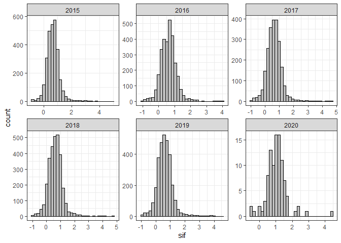<!-- -->

``` r
data_set_me %>%
  mutate(
  fct_year = fct_rev(as.factor(year)),
  ) %>%
  ggplot(aes(y=fct_year)) +
  geom_density_ridges(rel_min_height = 0.03,
                      aes(x=sif, fill=state),
                      alpha = .6, color = "black"
  ) +
  scale_fill_viridis_d() +
  theme_ridges() +
  theme(
    legend.position = "top"
  )
```

<!-- -->

``` r
#Estatística Descritiva
data_set_me |>
  group_by(year,state) |>
  summarise(
    N = length(sif),
    MIN = min(sif),
    MEAN = mean(sif),
    MEDIAN = median(sif),
    MAX = max(sif),
    VARIANCIA  = var(sif),
    STD_DV = sd(sif),
    CV = 100*STD_DV/MEAN,
    SKW = agricolae::skewness(sif),
    KRT = agricolae::kurtosis(sif),
  ) |>
  writexl::write_xlsx("output/estat-desc-sif.xlsx")
```

## Análise Geoestatística

### PASSO 1

``` r
my_year = 2015
my_state = "MT"
# Criar o adensamento de pontos
x<-data_set_me$longitude
y<-data_set_me$latitude
dis <- 0.05 #Distância entre pontos
grid <- expand.grid(X=seq(min(x),max(x),dis), Y=seq(min(y),max(y),dis)) |>
  mutate(
    flag_my_state = my_state,
    flag_st = def_pol(X, Y, list_pol[[my_state]]),
    flag_df = def_pol(X, Y, list_pol[["DF"]]),
    flag = ifelse(flag_my_state == "GO", (flag_st|flag_df),flag_st)
  ) |>  filter(flag) |>
  dplyr::select(-starts_with("flag"))
sp::gridded(grid) = ~ X + Y
# plot(grid$X,grid$Y,col="red",pch=4)
# points(x,y)
```

### Agregação dos dados

``` r
dist_agg <- .15 #Distância entre pontos
grid_agg <- expand.grid(
  X=seq(min(x),max(x),dist_agg), 
  Y=seq(min(y),max(y),dist_agg)) |>
  mutate(
    flag_my_state = my_state,
    flag_st = def_pol(X, Y, list_pol[[my_state]]),
    flag_df = def_pol(X, Y, list_pol[["DF"]]),
    flag = ifelse(flag_my_state == "GO", (flag_st|flag_df),flag_st)
  ) |>  filter(flag) |>
  dplyr::select(-starts_with("flag"))

data_set_me |>
  filter(year == 2015,state == my_state) |> 
  ggplot(aes(longitude,latitude)) +
  geom_point() +
  geom_point(data=grid_agg, aes(X,Y))
```

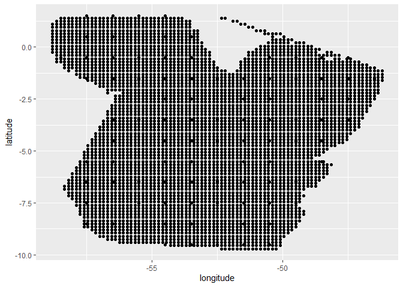<!-- -->

``` r
# Isolando o banco de dados, pelo ano
data_set_aux  <- data_set_me |>
  filter(
    year == my_year,
    state == my_state) |>
  group_by(latitude, longitude) |> 
  summarise(
    sif = mean(sif, na.rm = TRUE)
  ) |> 
  dplyr::select(longitude, latitude, sif)

# vct_sif <- vector();dist_sif <- vector();
# lon_grid <- vector();lat_grid <- vector();
# for(i in 1:nrow(data_set_aux)){
#   d <- sqrt((data_set_aux$longitude[i] - grid_agg$X)^2 + 
#               (data_set_aux$lat[i] - grid_agg$Y)^2
#   )
#   min_index <- order(d)[1]
#   vct_sif[i] <- data_set_aux$sif[min_index]
#   dist_sif[i] <- d[order(d)[1]]
#   lon_grid[i] <- grid_agg$X[min_index]
#   lat_grid[i] <- grid_agg$Y[min_index]
# }
# data_set_aux$dist_sif <- dist_sif
# data_set_aux$sif_new <- vct_sif
# data_set_aux$lon_grid <- lon_grid
# data_set_aux$lat_grid <- lat_grid
# data_set_aux |> 
#   group_by(lon_grid,lat_grid) |> 
#   summarise(
#     sif = mean(sif)
#   ) |> 
#   rename(longitude = lon_grid, latitude = lat_grid) -> data_set_aux
```

### PASSO 2 - Construção do Semivariograma Experimental

``` r
# Alteração no df
sp::coordinates(data_set_aux) = ~ longitude + latitude

# Fórmule é a variável que modelar, e o 1 da fórmula indica que ela
# não sofre transformação
form <- sif ~ 1
```

``` r
# Criando o Semivariograma Experimental.
vari_exp <- gstat::variogram(form, data = data_set_aux,
                      cressie = FALSE,
                      cutoff = 20, # distância máxima do semivariograma
                      width = 1.5) # distancia entre pontos
vari_exp  %>%
  ggplot(aes(x=dist, y=gamma)) +
  geom_point() +
  labs(x="lag (º)",
       y=expression(paste(gamma,"(h)")))
```

<!-- -->

### Passo 3 - Ajuste dos modelos

``` r
patamar=.035
alcance=1.5
epepita=0.01
modelo_1 <- gstat::fit.variogram(vari_exp,gstat::vgm(patamar,"Sph",alcance,epepita))
modelo_2 <- gstat::fit.variogram(vari_exp,gstat::vgm(patamar,"Exp",alcance,epepita))
modelo_3 <- gstat::fit.variogram(vari_exp,gstat::vgm(patamar,"Gau",alcance,epepita))
sqr.f1<-round(attr(modelo_1, "SSErr"),4); c01<-round(modelo_1$psill[[1]],4); c0_c11<-round(sum(modelo_1$psill),4);a1<-round(modelo_1$range[[2]],2)
sqr.f2<-round(attr(modelo_2, "SSErr"),4); c02<-round(modelo_2$psill[[1]],4); c0_c12<-round(sum(modelo_2$psill),4);a2<-round(3*modelo_2$range[[2]],2)
sqr.f3<-round(attr(modelo_3, "SSErr"),4); c03<-round(modelo_3$psill[[1]],4); c0_c13<-round(sum(modelo_3$psill),4);a3<-round(modelo_3$range[[2]]*(3^.5),2)

df_aux <- vari_exp %>%
  mutate(
    gamma_m1 = ifelse(dist <= a1, c01 + (c0_c11-c01)*(3/2*(dist/a1)-1/2*(dist/a1)^3),c0_c11),
    gamma_m2 = c02 + (c0_c12-c02)*(1-exp(-3*(dist/a2))),
    gamma_m3 = c03 + (c0_c13-c03)*(1-exp(-3*(dist/a3)^2)),
    residuo_total = (gamma-mean(gamma))^2,
    residuo_mod_1 = (gamma - gamma_m1)^2,
    residuo_mod_2 = (gamma - gamma_m2)^2,
    residuo_mod_3 = (gamma - gamma_m3)^2
  ) %>%
  summarise(
    r2_1=(sum(residuo_total) - sum(residuo_mod_1))/sum(residuo_total),
    r2_2=(sum(residuo_total) - sum(residuo_mod_2))/sum(residuo_total),
    r2_3=(sum(residuo_total) - sum(residuo_mod_3))/sum(residuo_total),
  )
r21<-as.vector(round(df_aux[1],4))
r22<-as.vector(round(df_aux[2],4))
r23<-as.vector(round(df_aux[3],4))

plot(vari_exp,
     model=modelo_1,
     col=1,pl=F,
     pch=16,
     cex=1.2,cex.main=7,
     ylab=list("Semivariância",cex=1.3),
     xlab=list("Distância de Separação h (m)",cex=1.3),
     main =paste("Esf(C0= ",c01,"; C0+C1= ",
                 c0_c11, "; a= ", a1,"; r2 = ",
                 r21,")",sep=""))
```

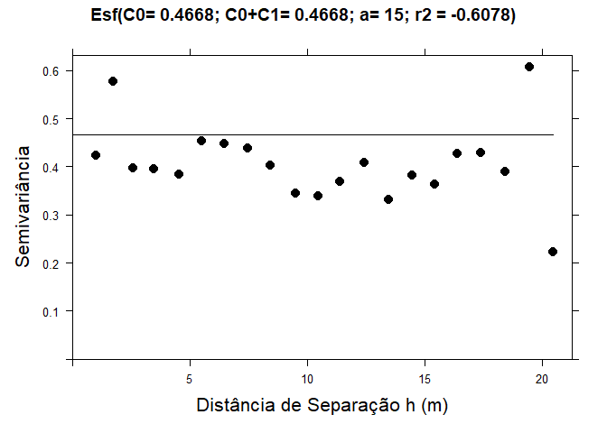<!-- -->

``` r
plot(vari_exp,model=modelo_2, col=1,pl=F,pch=16,cex=1.2,cex.main=7,ylab=list("Semivariância",cex=1.3),xlab=list("Distância de Separação h (m)",cex=1.3),main =paste("Exp(C0= ",c02,"; C0+C1= ", c0_c12, "; a= ", a2,"; r2 = ", r22,")",sep=""))
```

<!-- -->

``` r
plot(vari_exp,model=modelo_3, col=1,pl=F,pch=16,cex=1.2,cex.main=7,ylab=list("Semivariância",cex=1.3),xlab=list("Distância de Separação h (m)",cex=1.3),main =paste("Gau(C0= ",c03,"; C0+C1= ", c0_c13, "; a= ", a3,"; r2 = ", r23,")",sep=""))
```

<!-- -->

### Passo 4 - escolha do melhor modelo

``` r
# LOOCV - Leave one out cross validation
conjunto_validacao <- data_set_aux %>%
  as_tibble() %>%
  sample_n(50)
sp::coordinates(conjunto_validacao) = ~longitude + latitude
modelos<-list(modelo_1,modelo_2,modelo_3)
for(j in 1:3){
  est<-0
  for(i in 1:nrow(conjunto_validacao)){
    valid <- gstat::krige(formula=form, conjunto_validacao[-i,], conjunto_validacao, model=modelos[[j]])
    est[i]<-valid$var1.pred[i]
  }
  obs<-as.data.frame(conjunto_validacao)[,3]
  RMSE<-round((sum((obs-est)^2)/length(obs))^.5,3)
  mod<-lm(obs~est)
  b<-round(mod$coefficients[2],3)
  se<-round(summary(mod)$coefficients[4],3)
  r2<-round(summary(mod)$r.squared,3)
  a<-round(mod$coefficients[1],3)
  plot(est,obs,xlab="Estimado", ylab="Observado",pch=j,col="blue",
       main=paste("Modelo = ",modelos[[j]][2,1],"; Coef. Reg. = ", b, " (SE = ",se, ", r2 = ", r2,")\ny intersept = ",a,"RMSE = ",RMSE ))
  abline(lm(obs~est));
  abline(0,1,lty=3)
}
```

    ## [using ordinary kriging]
    ## [using ordinary kriging]
    ## [using ordinary kriging]
    ## [using ordinary kriging]
    ## [using ordinary kriging]
    ## [using ordinary kriging]
    ## [using ordinary kriging]
    ## [using ordinary kriging]
    ## [using ordinary kriging]
    ## [using ordinary kriging]
    ## [using ordinary kriging]
    ## [using ordinary kriging]
    ## [using ordinary kriging]
    ## [using ordinary kriging]
    ## [using ordinary kriging]
    ## [using ordinary kriging]
    ## [using ordinary kriging]
    ## [using ordinary kriging]
    ## [using ordinary kriging]
    ## [using ordinary kriging]
    ## [using ordinary kriging]
    ## [using ordinary kriging]
    ## [using ordinary kriging]
    ## [using ordinary kriging]
    ## [using ordinary kriging]
    ## [using ordinary kriging]
    ## [using ordinary kriging]
    ## [using ordinary kriging]
    ## [using ordinary kriging]
    ## [using ordinary kriging]
    ## [using ordinary kriging]
    ## [using ordinary kriging]
    ## [using ordinary kriging]
    ## [using ordinary kriging]
    ## [using ordinary kriging]
    ## [using ordinary kriging]
    ## [using ordinary kriging]
    ## [using ordinary kriging]
    ## [using ordinary kriging]
    ## [using ordinary kriging]
    ## [using ordinary kriging]
    ## [using ordinary kriging]
    ## [using ordinary kriging]
    ## [using ordinary kriging]
    ## [using ordinary kriging]
    ## [using ordinary kriging]
    ## [using ordinary kriging]
    ## [using ordinary kriging]
    ## [using ordinary kriging]
    ## [using ordinary kriging]

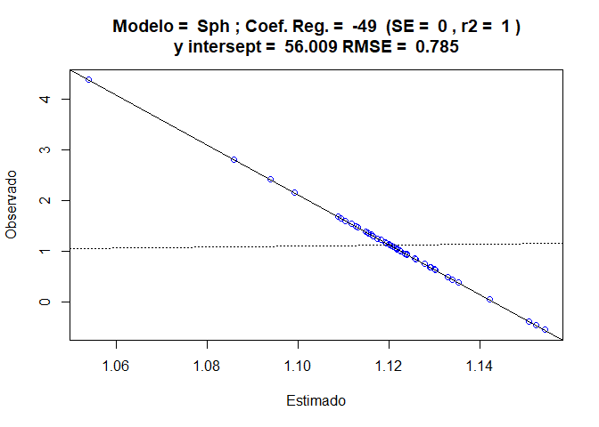<!-- -->

    ## [using ordinary kriging]
    ## [using ordinary kriging]
    ## [using ordinary kriging]
    ## [using ordinary kriging]
    ## [using ordinary kriging]
    ## [using ordinary kriging]
    ## [using ordinary kriging]
    ## [using ordinary kriging]
    ## [using ordinary kriging]
    ## [using ordinary kriging]
    ## [using ordinary kriging]
    ## [using ordinary kriging]
    ## [using ordinary kriging]
    ## [using ordinary kriging]
    ## [using ordinary kriging]
    ## [using ordinary kriging]
    ## [using ordinary kriging]
    ## [using ordinary kriging]
    ## [using ordinary kriging]
    ## [using ordinary kriging]
    ## [using ordinary kriging]
    ## [using ordinary kriging]
    ## [using ordinary kriging]
    ## [using ordinary kriging]
    ## [using ordinary kriging]
    ## [using ordinary kriging]
    ## [using ordinary kriging]
    ## [using ordinary kriging]
    ## [using ordinary kriging]
    ## [using ordinary kriging]
    ## [using ordinary kriging]
    ## [using ordinary kriging]
    ## [using ordinary kriging]
    ## [using ordinary kriging]
    ## [using ordinary kriging]
    ## [using ordinary kriging]
    ## [using ordinary kriging]
    ## [using ordinary kriging]
    ## [using ordinary kriging]
    ## [using ordinary kriging]
    ## [using ordinary kriging]
    ## [using ordinary kriging]
    ## [using ordinary kriging]
    ## [using ordinary kriging]
    ## [using ordinary kriging]
    ## [using ordinary kriging]
    ## [using ordinary kriging]
    ## [using ordinary kriging]
    ## [using ordinary kriging]
    ## [using ordinary kriging]

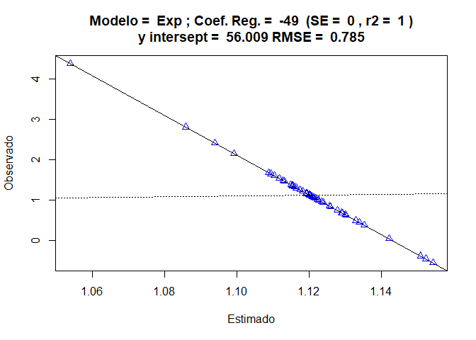<!-- -->

    ## [using ordinary kriging]
    ## [using ordinary kriging]
    ## [using ordinary kriging]
    ## [using ordinary kriging]
    ## [using ordinary kriging]
    ## [using ordinary kriging]
    ## [using ordinary kriging]
    ## [using ordinary kriging]
    ## [using ordinary kriging]
    ## [using ordinary kriging]
    ## [using ordinary kriging]
    ## [using ordinary kriging]
    ## [using ordinary kriging]
    ## [using ordinary kriging]
    ## [using ordinary kriging]
    ## [using ordinary kriging]
    ## [using ordinary kriging]
    ## [using ordinary kriging]
    ## [using ordinary kriging]
    ## [using ordinary kriging]
    ## [using ordinary kriging]
    ## [using ordinary kriging]
    ## [using ordinary kriging]
    ## [using ordinary kriging]
    ## [using ordinary kriging]
    ## [using ordinary kriging]
    ## [using ordinary kriging]
    ## [using ordinary kriging]
    ## [using ordinary kriging]
    ## [using ordinary kriging]
    ## [using ordinary kriging]
    ## [using ordinary kriging]
    ## [using ordinary kriging]
    ## [using ordinary kriging]
    ## [using ordinary kriging]
    ## [using ordinary kriging]
    ## [using ordinary kriging]
    ## [using ordinary kriging]
    ## [using ordinary kriging]
    ## [using ordinary kriging]
    ## [using ordinary kriging]
    ## [using ordinary kriging]
    ## [using ordinary kriging]
    ## [using ordinary kriging]
    ## [using ordinary kriging]
    ## [using ordinary kriging]
    ## [using ordinary kriging]
    ## [using ordinary kriging]
    ## [using ordinary kriging]
    ## [using ordinary kriging]

<!-- -->

### Passo 5 - Selecionado o melhor modelo, vamos guardá-lo

``` r
modelo <- modelo_2 ## sempre modificar
# Salvando os parâmetros dos melhores modelo
model <- modelo |> slice(2) |> pull(model)
rss <- round(attr(modelo, "SSErr"),4) 
c0 <- round(modelo$psill[[1]],4) 
c0_c1 <- round(sum(modelo$psill),4)
a <- ifelse(model == "Gau", round(modelo$range[[2]]*(3^.5),2),
            ifelse(model == "Exp",round(3*modelo$range[[2]],2),
            round(modelo$range[[2]],2)))
r2 <- ifelse(model == "Gau", r23,
            ifelse(model == "Exp",r22,
            r21)) |> pluck(1)
tibble(
  my_state, my_year, model, c0, c0_c1, a, rss, r2
) |> mutate(gde = c0/c0_c1, .after = "a") |>
  rename(state=my_state,year=my_year) |> 
  write_csv(paste0("output/best-fit/",my_state,"-",my_year,"-sif.csv"))

ls_csv <- list.files("output/best-fit/",full.names = TRUE,pattern = "-sif.csv")
map_df(ls_csv, read_csv) |> 
  writexl::write_xlsx("output/semivariogram-models-sif.xlsx")
png(filename = paste0("output/semivariogram-img/semivar-sif-",
                      my_state,"-",my_year,".png"),
    width = 800, height = 600)
plot(vari_exp,model=modelo,cex.lab=2, col=1,pl=F,pch=16,cex=2.2,ylab=list("Semivariância",cex=2.3),xlab=list("Distância de Separação h (m)",cex=2.3,cex.axis=4))
dev.off()
```

    ## png 
    ##   2

### Passo 6 - Krigagem Ordinária - interpolação em locais não amostrados

``` r
ko_variavel <- gstat::krige(formula=form, data_set_aux, grid, model=modelo,
                     block=c(0.1,0.1),
                     nsim=0,
                     na.action=na.pass,
                     debug.level=-1
)
```

    ## [using ordinary kriging]
    ##  43% done100% done

## Passo 7 Visualização dos padrões espaciais e armazenamento dos dados e imagem.

``` r
mapa <- as.tibble(ko_variavel) %>%
  ggplot(aes(x=X, y=Y)) +
  geom_tile(aes(fill = var1.pred)) +
  scale_fill_viridis_c() +
  coord_equal() +
  labs(x="Longitude",
       y="Latitude",
       fill="sif") +
  theme_bw()
mapa
```

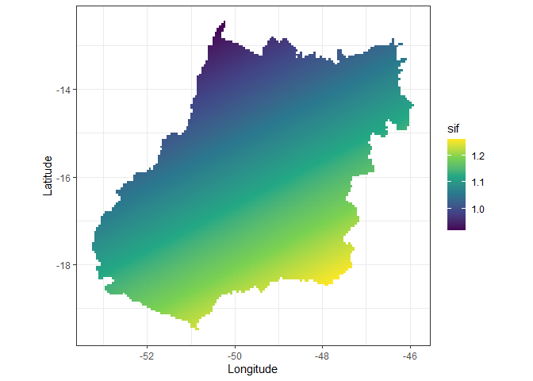<!-- -->

``` r
ggsave(paste0("output/maps-kgr/kgr-sif-",my_state,"-",my_year,".png"), plot = mapa, width = 10, height = 8, dpi = 300)
df <- ko_variavel %>%
  as.tibble() %>%
  mutate(var1.var = sqrt(var1.var)) 
write_rds(df,paste0("output/maps-kgr/kgr-sif-",my_state,"-",my_year,".rds"))
```

<!-- ## CARREGANDO OS PACOTES -->
<!-- ```{r} -->
<!-- library(tidyverse) -->
<!-- library(gstat) -->
<!-- library(skimr) -->
<!-- library(ggsci) -->
<!-- library(geobr) -->
<!-- source("R/my-function.R") -->
<!-- ``` -->
<!-- ## IMPORTANDO A BASE DE DADOS -->
<!-- ```{r} -->
<!-- brazil_ids <- read_rds("data/df_nome.rds") -->
<!-- nomes_uf <- c(brazil_ids$nome_uf %>% unique(),"Brazil") -->
<!-- dados2 <- read_rds('data/emissions_sources.rds') -->
<!-- ``` -->
<!-- ## CARACTERIZANDO MUNICÍPIO -->
<!-- ```{r} -->
<!-- city <- geobr::read_municipality( -->
<!--   showProgress = FALSE) -->
<!-- cities <- city -->
<!-- ``` -->
<!-- ## CRIANDO TEMA GRAFICO -->
<!-- ```{r} -->
<!-- my_theme <- theme( -->
<!--        # axis.text.x = element_text(size = rel(1.25)), -->
<!--         axis.title.x = element_text(size = rel(1.4)), -->
<!--        # axis.text.y = element_text(size = rel(1.3)), -->
<!--         axis.title.y = element_text(size = rel(1.4)), -->
<!--         legend.text = element_text(size = rel(0.9)), -->
<!--        # legend.title = element_text(size = rel(1.7)), -->
<!--        title = element_text(face = 'bold'), -->
<!--        legend.position = "top", -->
<!--        legend.background = element_rect(fill = "#fffff0", color = "black")) -->
<!-- my_theme_add <- function(.my_theme){ -->
<!--  theme( -->
<!--        # axis.text.x = element_text(size = rel(1.25)), -->
<!--         axis.title.x = element_text(size = rel(1.4)), -->
<!--        # axis.text.y = element_text(size = rel(1.3)), -->
<!--         axis.title.y = element_text(size = rel(1.4)), -->
<!--         legend.text = element_text(size = rel(0.9)), -->
<!--        # legend.title = element_text(size = rel(1.7)), -->
<!--        title = element_text(face = 'bold'), -->
<!--        legend.position = "top", -->
<!--        legend.background = element_rect(fill = "transparent", color = "black")) -->
<!-- } -->
<!-- ``` -->
<!-- ## MAPEAR -->
<!-- ### CONTRUINDO MAPA COM CLASSES -->
<!-- ```{r} -->
<!-- #my_state <- "MS" ### <- -->
<!-- estados <- c("PA", "MS", "MG", "MT", "SP","GO","PR","SC","RS") -->
<!-- my_plot_map <- function(.estados){ -->
<!--   city %>% -->
<!--   select(abbrev_state) %>% -->
<!--   filter( -->
<!--     abbrev_state == .estados) %>% -->
<!--   ggplot() + -->
<!--   geom_sf(fill="white", color="black", -->
<!--           size=.15, show.legend = F) + -->
<!--   geom_point(data = dados2 %>% -->
<!--                filter(year == 2022, #>2014 & year <2023 -->
<!--                       sigla_uf == .estados, -->
<!--                       str_detect(activity_units, 'animal'), -->
<!--                       gas == 'co2e_100yr') %>% -->
<!--                mutate( -->
<!--                  classe_emissao = case_when( -->
<!--                    emissions_quantity <0.1e6 ~ '< 0.1 Mton', -->
<!--                    emissions_quantity <0.4e6 ~ '< 0.4 Mton', -->
<!--                    emissions_quantity <1e6 ~ '< 1 Mton', -->
<!--                    emissions_quantity >=1e6 ~ '>= 1 Mton' -->
<!--                  ) -->
<!--                ), -->
<!--              size = 1.5, -->
<!--              aes(lon,lat, col = classe_emissao)) + -->
<!--     theme_bw() + -->
<!--   theme( -->
<!--     axis.text.x = element_text(size = rel(1), color = "#222222"), -->
<!--     axis.title.x = element_text(size = rel(1.3), color = "#222222"), -->
<!--     axis.text.y = element_text(size = rel(1), color = "#222222"), -->
<!--     axis.title.y = element_text(size = rel(1.3), color = "#222222"), -->
<!--     legend.text = element_text(size = rel(1.3), color = "#222222"), -->
<!--     legend.title = element_text(size = rel(1.5)), -->
<!--     ) + -->
<!--    labs(col = 'CO'[2]~'eq emission', -->
<!--         x = 'Longitude', -->
<!--         y = 'Latitude' -->
<!--      #title = paste0("CO2e emission for", my_state), -->
<!--         # caption = 'Data Source: Climate TRACE', -->
<!--      ) -->
<!-- } -->
<!-- map(estados,my_plot_map) -->
<!-- # ggsave('GO.png', dpi = 3000, width = 9, height = 5.5) -->
<!-- ``` -->
<!-- ```{r} -->
<!-- # estado <- "MG" ### <- -->
<!-- # estados <- c("MS", "PA", "GO", "MT", "MG") -->
<!-- # -->
<!-- # my_plot_map_join <- function(.estados){ -->
<!-- #   left_join(city %>% filter(abbrev_state == .estados), -->
<!-- #           dados2 %>% -->
<!-- #             filter(year == 2022, #>2014 & year <2023 -->
<!-- #                    sigla_uf == .estados, -->
<!-- #                    !source_name %in% nomes_uf, -->
<!-- #                    str_detect(activity_units, 'animal'),            #filtering the four subsectors for cattle -->
<!-- #                    gas == 'co2e_100yr') %>% -->
<!-- #             group_by(city_ref, sigla_uf)  %>% -->
<!-- #             summarise(emissions_quantity = -->
<!-- #                         sum(emissions_quantity, na.rm = TRUE)) %>% -->
<!-- #             rename(name_muni = city_ref) , -->
<!-- #           by="name_muni") %>% -->
<!-- #   mutate(emissions_quantity = replace_na(emissions_quantity,0)) %>% -->
<!-- #   mutate( -->
<!-- #     classe_emissao = case_when( -->
<!-- #       emissions_quantity <0.1e6 ~ '< 0.1 Mton', -->
<!-- #       emissions_quantity <0.4e6 ~ '< 0.4 Mton', -->
<!-- #       emissions_quantity <0.7e6 ~ '< 0.7 Mton', -->
<!-- #       emissions_quantity >=1 ~ '>= 1 Mton' -->
<!-- #     ) -->
<!-- #   ) %>% -->
<!-- #     ggplot() + -->
<!-- #     geom_sf(aes(fill=classe_emissao), color="black", -->
<!-- #             size=.15, show.legend = TRUE)  + -->
<!-- #     theme_bw() + -->
<!-- #   theme( -->
<!-- #     axis.text.x = element_text(size = rel(1), color = "#222222"), -->
<!-- #     axis.title.x = element_text(size = rel(1.3), color = "#222222"), -->
<!-- #     axis.text.y = element_text(size = rel(1), color = "#222222"), -->
<!-- #     axis.title.y = element_text(size = rel(1.3), color = "#222222"), -->
<!-- #     legend.text = element_text(size = rel(1.3), color = "#222222"), -->
<!-- #     legend.title = element_text(size = rel(1.5)), -->
<!-- #     ) + -->
<!-- #    labs(fill = 'CO'[2]'e emission', -->
<!-- #         x = 'Longitude', -->
<!-- #         y = 'Latitude' -->
<!-- #      #title = paste0("CO2e emission for", my_state), -->
<!-- #         # caption = 'Data Source: Climate TRACE', -->
<!-- #      ) + -->
<!-- #     scale_fill_viridis_d() -->
<!-- # } -->
<!-- # map(estados,my_plot_map_join) -->
<!-- # ggsave('MGg_col.png', dpi = 2000, width = 9, height = 5.5) -->
<!-- #Gerando os mapas em uma única figura -->
<!--  # mapas_contorno1 <- read_state(code_state="MS") -->
<!--  # mapas_contorno2 <- read_state(code_state="MT") -->
<!--  # mapas_contorno3 <- read_state(code_state="MG") -->
<!--  # mapas_contorno4 <- read_state(code_state="PA") -->
<!--  # mapas_contorno5 <- read_state(code_state="GO") -->
<!-- states <- geobr::read_state(showProgress = FALSE) -->
<!-- mapa_contorno <- states %>%  -->
<!--   filter(abbrev_state %in% estados) -->
<!-- ``` -->
<!-- ```{r} -->
<!-- left_join(city %>% filter(abbrev_state %in% estados), -->
<!--            dados2 %>% -->
<!--              filter(year == 2022,                 #%in% 2015:2022 -->
<!--                     sigla_uf %in% estados, -->
<!--                     !source_name %in% nomes_uf, -->
<!--                     str_detect(activity_units, 'animal'),            #filtering the four subsectors for cattle -->
<!--                     gas == 'co2e_100yr') %>% -->
<!--              group_by(city_ref, sigla_uf)  %>% -->
<!--              summarise(emissions_quantity = -->
<!--                          sum(emissions_quantity, na.rm = TRUE)) %>% -->
<!--              rename(name_muni = city_ref), -->
<!--            by="name_muni") %>% -->
<!--    mutate(emissions_quantity = replace_na(emissions_quantity, 0)) %>% -->
<!--    mutate( -->
<!--      classe_emissao = case_when( -->
<!--        emissions_quantity <.1e6 ~ ' <  0,1 Mton', -->
<!--        emissions_quantity <.5e6 ~ ' <  0,5 Mton', -->
<!--        emissions_quantity < 1e6 ~ ' <  1,0 Mton', -->
<!--        emissions_quantity >=1e6 ~ '>= 1,0 Mton' -->
<!--      ) -->
<!--    ) %>% -->
<!--      ggplot() + -->
<!--      geom_sf(aes(fill=classe_emissao), color="black", -->
<!--              size=.05, show.legend = TRUE)  + -->
<!--    geom_sf(data=mapa_contorno, fill="transparent", color="red", size=3, show.legend = FALSE) + -->
<!--    # geom_sf(data=mapas_contorno2, fill="transparent", color="red", size=3, show.legend = FALSE) + -->
<!--    # geom_sf(data=mapas_contorno3, fill="transparent", color="red", size=3, show.legend = FALSE) + -->
<!--    # geom_sf(data=mapas_contorno4, fill="transparent", color="red", size=3, show.legend = FALSE) + -->
<!--    # geom_sf(data=mapas_contorno5, fill="transparent", color="red", size=3, show.legend = FALSE) + -->
<!--      theme_bw() + -->
<!--    theme( -->
<!--      axis.text.x = element_text(size = rel(.9), color = "black"), -->
<!--      axis.title.x = element_text(size = rel(1.1), color = "black"), -->
<!--      axis.text.y = element_text(size = rel(.9), color = "black"), -->
<!--      axis.title.y = element_text(size = rel(1.1), color = "black"), -->
<!--      legend.text = element_text(size = rel(1), color = "black"), -->
<!--      legend.title = element_text(face = 'bold', size = rel(1.2)), -->
<!--      legend.position = c(1.29, .5) -->
<!--      ) + -->
<!--    labs(fill = 'Classe de emissão', -->
<!--          x = 'Longitude', -->
<!--          y = 'Latitude') + -->
<!--      scale_fill_viridis_d() -->
<!--  # ggsave('Maps_states_red.png') -->
<!--  ggsave('img/mapa_nova_classe.png') -->
<!-- ``` -->
<!-- ### Verificando maiores cidades emissoras -->
<!-- ```{r} -->
<!-- # Only for analysis -->
<!-- dados2 |> -->
<!--   #glimpse() |> -->
<!--   #select(sigla_uf, emissions_quantity, city_ref, gas, activity_units, sector_name, sub_sector) |> -->
<!--   filter(sigla_uf == "PA", -->
<!--          gas == 'co2e_100yr', -->
<!--          year == 2015, -->
<!--          sector_name == 'agriculture', -->
<!--          !source_name %in% nomes_uf, -->
<!--          # !sub_sector %in% c("forest-land-clearing", -->
<!--          #                    "forest-land-degradation", -->
<!--          #                    "shrubgrass-fires", -->
<!--          #                    "forest-land-fires", -->
<!--          #                    "wetland-fires", -->
<!--          #                    "removals"), -->
<!--          # str_detect(activity_units, 'animal'), -->
<!--          # sub_sector == 'enteric-fermentation-cattle-pasture', -->
<!--                          # 'manure-left-on-pasture-cattle'), -->
<!--          city_ref == 'São Félix Do Xingu'                       #change the municipality here -->
<!--           ) #|> -->
<!--   # group_by(sub_sector, sector_name) |> -->
<!--   # summarise( -->
<!--   #    emission = sum(emissions_quantity, na.rm = T) -->
<!--   #  ) -->
<!-- ``` -->
<!-- ## VISUALIZANDO MAIORES EMISSORES PARA O SETOR DE AGRICULTURA OU P/ ANIMAL -->
<!-- ```{r} -->
<!-- dados2 %>% -->
<!--   filter( -->
<!--     year == 2022,                   #%in% 2015:2022 -->
<!--     sigla_uf %in% estados, # <----- -->
<!--     str_detect(activity_units, 'animal'), -->
<!--     # sector_name == 'agriculture', -->
<!--     !source_name %in% nomes_uf, -->
<!--     gas == 'co2e_100yr' -->
<!--     ) %>% -->
<!--   group_by(city_ref, sigla_uf, sub_sector) %>% -->
<!--   summarise( -->
<!--     emission = sum(emissions_quantity, na.rm = T) -->
<!--   ) %>% -->
<!--   group_by(city_ref,sigla_uf) %>% -->
<!--   mutate( -->
<!--     emission_total = sum(emission, na.rm = T) -->
<!--   ) %>% -->
<!--   ungroup() %>% -->
<!--   group_by(sigla_uf) %>% -->
<!--   mutate( -->
<!--     city_ref = city_ref %>% fct_reorder(emission_total) %>% -->
<!--       fct_lump(n = 3, w = emission_total)) %>% -->
<!--   filter(city_ref != "Other") %>% -->
<!--   mutate( -->
<!--       sub_sector = case_when( -->
<!--         sub_sector == "enteric-fermentation-cattle-feedlot" ~ "FEGC", -->
<!--         sub_sector == "enteric-fermentation-cattle-pasture" ~ "FEGP", -->
<!--         sub_sector == "manure-left-on-pasture-cattle"  ~ "EP", -->
<!--         sub_sector == "manure-management-cattle-feedlot" ~ "GEC", -->
<!--         sub_sector == 'cropland-fires' ~ 'CF', -->
<!--         sub_sector == 'synthetic-fertilizer-application' ~ 'SF application' -->
<!--       )) |> -->
<!--   ggplot(aes(emission/1e6, #passar de ton para Mton -->
<!--              city_ref, -->
<!--              fill = sub_sector)) + -->
<!--   geom_col(col="black", lwd = 0.1) + -->
<!--   xlab(bquote(Emissião~CO[2]~e~(Mton))) + -->
<!--   labs(#x = 'Emission (Mton)', -->
<!--        y = 'Cidade', -->
<!--        fill = 'Subsetor') + -->
<!--   theme_bw() + -->
<!--   theme( -->
<!--     axis.text.x = element_text(size = rel(1)), -->
<!--     # axis.title.x = element_text(size = rel(2)), -->
<!--     axis.text.y = element_text(size = rel(1.3)), -->
<!--     # axis.title.y = element_text(size = rel(2)), -->
<!--     legend.text = element_text(size = rel(1)), -->
<!--     #legend.title = element_text(size = rel(1.7)), -->
<!--     title = element_text(face = 'bold'), -->
<!--     legend.position = 'top', -->
<!--     legend.background = element_rect(fill = "transparent", color = "black")) + -->
<!--       scale_fill_viridis_d(option ='plasma') + -->
<!--   facet_wrap(~sigla_uf,scales = "free",ncol = 2) + -->
<!--   annotate("text", -->
<!--            x=2, -->
<!--            y=1, -->
<!--            label = ".", -->
<!--            size=0.1) -->
<!-- ggsave('img/top3cidades_emissão_states.png') -->
<!-- ``` -->
<!-- ```{r} -->
<!-- # Only for exemplification in the report -->
<!-- estado <- 'MG' -->
<!-- my_plot_col_states <- function(.estados){ -->
<!--   dados2 %>% -->
<!--   filter( -->
<!--     year == 2022, -->
<!--     sigla_uf == .estados, -->
<!--     !source_name %in% nomes_uf, -->
<!--     #str_detect(activity_units, 'animal'), -->
<!--     sector_name == 'agriculture', -->
<!--     gas == 'co2e_100yr' -->
<!--     ) %>% -->
<!--   group_by(city_ref, sub_sector) %>% -->
<!--   summarise( -->
<!--     emission = sum(emissions_quantity, na.rm = T) -->
<!--   ) %>% -->
<!--   group_by(city_ref) %>% -->
<!--   mutate( -->
<!--     emission_total = sum(emission, na.rm = T) -->
<!--   ) %>% -->
<!--   ungroup() %>% -->
<!--   mutate( -->
<!--     city_ref = city_ref %>% fct_reorder(emission_total) %>% -->
<!--       fct_lump(n = 5, w = emission_total)) %>% -->
<!--   filter(city_ref != "Other") %>% -->
<!--     mutate( -->
<!--       sub_sector = case_when( -->
<!--         sub_sector == "cropland-fires"  ~ "Cropland fires", -->
<!--         sub_sector == "enteric-fermentation-cattle-feedlot" ~ "EFC feedlot", -->
<!--         sub_sector == "enteric-fermentation-cattle-pasture" ~ "EFC pasture", -->
<!--         sub_sector == "manure-left-on-pasture-cattle"  ~ "ML pasture cattle", -->
<!--         sub_sector == "manure-management-cattle-feedlot" ~ "MMC feedlot", -->
<!--         sub_sector == "rice-cultivation" ~ "rice cultivation", -->
<!--         sub_sector == "synthetic-fertilizer-application" ~ "SF application", -->
<!--       ) -->
<!--     ) %>% -->
<!--   ggplot(aes(emission/1e6, -->
<!--              city_ref, -->
<!--              fill = sub_sector)) + -->
<!--   geom_col(col="black", lwd = 0.1) + -->
<!--     xlab(bquote(Emission~CO[2]~e~(Mton))) + -->
<!--   labs(#x = 'Emission (Mton)', -->
<!--        y = 'City', -->
<!--        fill = '') + -->
<!--   theme_bw() + -->
<!--   map(my_theme,my_theme_add) + -->
<!--   theme(legend.position = "top", ##retirar legenda = '' -->
<!--     legend.background = element_rect(fill = "transparent")) + ##? -->
<!--   scale_fill_viridis_d(option = "plasma") + -->
<!--   annotate("text", -->
<!--            x=2, -->
<!--            y=1, -->
<!--            label = ".", -->
<!--            size=0.1) -->
<!--   } -->
<!--   # geom_text(stat = 'identity', -->
<!--   #           position = 'identity', -->
<!--   #           size = 4, -->
<!--   #           angle = 90, -->
<!--   #           vjust = 2, -->
<!--   #           data = NULL, -->
<!--   #           label = 'emission') -->
<!-- map(estados,my_plot_col_states) -->
<!-- # ggsave('MG_legenda_setor_agr.png', dpi = 3000) -->
<!-- ``` -->
<!-- ## SUBSETORES -->
<!-- ### CARACTERIZANDO SUBSETORES PARA EMISSÕES DE GADO E RANKEANDO AS 5 CIDADES COM SUBSETORES DE MAIOR EMISSÃO DENTRE OS 5 ESTADOS -->
<!-- ```{r} -->
<!-- # my_plot_subsector_states <- function(.estados){ -->
<!--   dados2 %>% -->
<!--   filter( -->
<!--          year == 2022, -->
<!--          str_detect(activity_units, 'animal'), -->
<!--          gas == 'co2e_100yr', -->
<!--          !source_name %in% nomes_uf, -->
<!--          sigla_uf %in% estados) |> -->
<!--   group_by(city_ref, original_inventory_sector, sigla_uf) %>% -->
<!--   summarise( -->
<!--     emission = sum(emissions_quantity, na.rm = T) -->
<!--   ) %>% -->
<!--   # ungroup() |> -->
<!--   group_by(city_ref,sigla_uf) %>% -->
<!--   mutate( -->
<!--     emission_total = sum(emission, na.rm = T) -->
<!--   ) %>% -->
<!--   ungroup() %>% -->
<!--   mutate( -->
<!--     city_ref = city_ref %>% fct_reorder(emission_total) %>% -->
<!--       fct_lump(n = 10, w = emission_total)) %>% -->
<!--   mutate( -->
<!--        original_inventory_sector = original_inventory_sector %>% -->
<!--          as_factor() %>% -->
<!--          fct_relevel("manure-left-on-pasture-cattle", -->
<!--           "enteric-fermentation-cattle-feedlot", -->
<!--           "manure-management-cattle-feedlot", -->
<!--           "enteric-fermentation-cattle-pasture") -->
<!--     ) %>% -->
<!--   filter(city_ref != "Other") %>% -->
<!--   mutate( -->
<!--       original_inventory_sector = case_when( -->
<!--         original_inventory_sector == "enteric-fermentation-cattle-feedlot" ~ "FEGC", -->
<!--         original_inventory_sector == "enteric-fermentation-cattle-pasture" ~ "FEGP", -->
<!--         original_inventory_sector == "manure-left-on-pasture-cattle"  ~ "EP", -->
<!--         original_inventory_sector == "manure-management-cattle-feedlot" ~ "GEC", -->
<!--       )) |> -->
<!--   ggplot(aes(emission/1e6, #passar para Mega Ton -->
<!--              city_ref, -->
<!--              fill = original_inventory_sector)) + -->
<!--   geom_col(col="black") + -->
<!--   labs(x = 'Emissão (Mton)', -->
<!--        y = 'City', -->
<!--        fill = 'Subsetor') + -->
<!--   theme_bw() + -->
<!--   # map(my_theme,my_theme_add) + -->
<!--   theme(legend.position = "top") + -->
<!--   scale_fill_viridis_d(option = "plasma") + -->
<!--     # facet_wrap(~city_ref,,ncol = 2) + -->
<!--   annotate("text", -->
<!--            x=5, -->
<!--            y=1, -->
<!--            label = ".", -->
<!--            size=0.1) -->
<!-- # } -->
<!-- # map(estados,my_plot_subsector_states) -->
<!-- # ggsave('top10.png', dpi = 2000) -->
<!-- ``` -->
<!-- ```{r} -->
<!-- # dados2 %>% -->
<!-- #   filter( -->
<!-- #     year == 2022, -->
<!-- #     sigla_uf %in% estados, -->
<!-- #     !source_name %in% nomes_uf, -->
<!-- #     gas == 'co2e_100yr', -->
<!-- #     # sector_name == 'agriculture' -->
<!-- #     str_detect(activity_units, 'animal') -->
<!-- #     ) %>% -->
<!-- #   select(original_inventory_sector, emissions_quantity, city_ref) %>% -->
<!-- #   group_by(city_ref, original_inventory_sector) %>% -->
<!-- #   summarise( -->
<!-- #     emission = sum(emissions_quantity, na.rm = T) -->
<!-- #   ) %>% -->
<!-- #   arrange( - emission) %>% -->
<!-- #   group_by(city_ref) %>% -->
<!-- #   mutate( -->
<!-- #     emission_total = sum(emission, na.rm = T) -->
<!-- #   ) %>% -->
<!-- #   ungroup() %>% -->
<!-- #   mutate( -->
<!-- #     city_ref = city_ref %>% fct_reorder(emission_total) %>% -->
<!-- #       fct_lump(n = 5, w = emission_total)) %>% -->
<!-- #   filter(city_ref != "Other") %>% -->
<!-- #   ggplot(aes(emission/1e6, -->
<!-- #              city_ref, -->
<!-- #              fill = original_inventory_sector)) + -->
<!-- #   geom_col(col="black") + -->
<!-- #   labs(x = 'Emission (Mton)', -->
<!-- #        y = 'City', -->
<!-- #        fill = 'Subsector') + -->
<!-- #   theme_bw() + -->
<!-- #   map(my_theme,my_theme_add) + -->
<!-- #   theme(legend.position = 'top') + -->
<!-- #   scale_fill_viridis_d(option = 'plasma') -->
<!-- ``` -->
<!-- ## AGRUPAR POR ESTADO, EMISSÃO E SETOR -->
<!-- ```{r} -->
<!-- dados2 %>% -->
<!--   filter( -->
<!--     year == 2022, -->
<!--     sigla_uf %in% estados, -->
<!--     !source_name %in% nomes_uf, -->
<!--     gas == 'co2e_100yr', -->
<!--     str_detect(activity_units, 'animal')) |> -->
<!--   mutate( -->
<!--       original_inventory_sector = case_when( -->
<!--         original_inventory_sector == "enteric-fermentation-cattle-feedlot" ~ "FEGC", -->
<!--         original_inventory_sector == "enteric-fermentation-cattle-pasture" ~ "FEGP", -->
<!--         original_inventory_sector == "manure-left-on-pasture-cattle"  ~ "EP", -->
<!--         original_inventory_sector == "manure-management-cattle-feedlot" ~ "GEC" -->
<!--       )) |> -->
<!--   select(original_inventory_sector, emissions_quantity, sigla_uf) %>% -->
<!--   group_by(sigla_uf, original_inventory_sector) %>% -->
<!--   arrange( desc(emissions_quantity)) %>% -->
<!--   summarise( -->
<!--     emission = sum(emissions_quantity, na.rm = T) -->
<!--   ) %>% -->
<!--   mutate(emission_total = sum(emission)) %>% -->
<!--   arrange( - emission) %>% -->
<!--   ungroup() %>% -->
<!--   mutate( -->
<!--     sigla_uf = sigla_uf %>% -->
<!--   fct_reorder(emission_total)) %>% -->
<!--   ggplot(aes(emission/1e6, -->
<!--              sigla_uf, -->
<!--              fill = original_inventory_sector)) + -->
<!--   geom_col(color ="black", lwd = 0.1) + -->
<!--   xlab(bquote(Emissão~de~CO[2]~e~(Mton))) + -->
<!--   labs(#x = 'Emissão de CO2 (Mton)', -->
<!--        y = 'Estado', -->
<!--        fill = 'Subsetor') + -->
<!--   theme_bw() + -->
<!--   map(my_theme,my_theme_add) + -->
<!--   map(my_theme,my_theme_add) + -->
<!--   theme(legend.position = 'top') + -->
<!--   scale_fill_viridis_d(option = 'plasma') -->
<!-- # ggsave('States_emission.png') -->
<!-- ``` -->
<!-- ## TOTAL DE EMISSÃO PARA OS ESTADOS/BR -->
<!-- ```{r} -->
<!-- dados2 %>% -->
<!--   filter(year == 2022, -->
<!--          str_detect(activity_units, 'animal'),          #cattle -->
<!--          # sector_name == 'agriculture', -->
<!--          !source_name %in% nomes_uf, -->
<!--          sigla_uf %in% estados, -->
<!--          gas == 'co2e_100yr') %>% -->
<!--   group_by(sigla_uf) %>%                  #!! group_by(iso3_country)  #to BR -->
<!--   summarise( -->
<!--     soma_emissao = sum(emissions_quantity) -->
<!--     ) %>% -->
<!--   arrange(- soma_emissao) -->
<!-- ``` -->
<!-- ## SERIE TEMPORAL, 2015 A 2022 -->
<!-- ```{r} -->
<!-- dados2 %>% -->
<!--   filter( -->
<!--     # year <= 2022, -->
<!--     gas == 'co2e_100yr', -->
<!--     !source_name %in% nomes_uf, -->
<!--     str_detect(activity_units, 'animal') -->
<!--   ) %>%  # pull(sigla_uf) %>% unique() -->
<!--   group_by(year) %>% -->
<!--   summarise( -->
<!--     soma_emissao= sum(emissions_quantity, na.rm = TRUE)/1e6 #, -->
<!--     # media_emissao = mean(emissions_quantity, na.rm = TRUE)/1e6, -->
<!--     # sd_emissao = sd(emissions_quantity/1e6, na.rm = TRUE) -->
<!--   )  %>% -->
<!--   mutate( -->
<!--     sigla_uf = "Br" -->
<!--   ) %>% -->
<!--   rbind(dados2 %>% -->
<!--             filter(sigla_uf %in% estados, -->
<!--             str_detect(activity_units, 'animal'), -->
<!--             gas == 'co2e_100yr', -->
<!--             !source_name %in% nomes_uf -->
<!--           ) %>% -->
<!--           group_by(year, sigla_uf) %>% -->
<!--           summarise( -->
<!--             soma_emissao= sum(emissions_quantity)/1e6 #, -->
<!--             # media_emissao = mean(emissions_quantity)/1e6, -->
<!--             # sd_emissao = sd(emissions_quantity/1e6) -->
<!--           ) -->
<!--   ) %>% -->
<!--   filter(sigla_uf != "Br") %>% -->
<!--   ggplot(aes(x=year,y=soma_emissao, -->
<!--              fill=sigla_uf))+ -->
<!--   #geom_point()+ -->
<!--   #geom_smooth(method = 'lm')+ -->
<!--   #ggpubr::stat_cor()+ -->
<!--   geom_col(position = "dodge", color="black") +    #erro com position = "identity" [CIC] ; position = "dodge" [RF] -->
<!--   theme_bw() + -->
<!--   map(my_theme, my_theme_add) + -->
<!--   theme( -->
<!--     legend.text = element_text(size = rel(1.3)) -->
<!--   ) + -->
<!--   labs(x = 'Ano', -->
<!--        y = 'Emissão total', -->
<!--        fill="") + -->
<!--   scale_fill_viridis_d() -->
<!-- ggsave('img/TemporalEmissions-states.png') -->
<!-- ``` -->
<!-- ## TESTANDO FAZER EMISSÃO MEDIA POR CABEÇA DE GADO COM DADOS IBGE -->
<!-- ```{r} -->
<!-- # Tentativa faiada -->
<!-- #  -->
<!-- # estados <- c("PA", "MS", "MG", "MT", "GO") -->
<!-- #  -->
<!-- # ibge2 <- ibge |> -->
<!-- #   rename( -->
<!-- #     sigla_uf = localidade -->
<!-- #   ) |> -->
<!-- #   mutate( -->
<!-- #     sigla_uf = case_when( -->
<!-- #       sigla_uf == 'Mato Grosso do Sul'~'MS', -->
<!-- #       sigla_uf == 'Mato Grosso'~'MT', -->
<!-- #       sigla_uf == 'Minas Gerais'~'MG', -->
<!-- #       sigla_uf == 'Goiás'~'GO', -->
<!-- #       sigla_uf == 'Pará'~'PA' -->
<!-- #     ) -->
<!-- #   ) |> -->
<!-- #   filter( -->
<!-- #     sigla_uf %in% estados -->
<!-- #   ) -->
<!-- #  -->
<!-- # states <- c('Pará', 'Mato Grosso do Sul', 'Mato Grosso', 'Minas Gerais', 'Goiás') -->
<!-- #  -->
<!-- # full_join(ibge %>% filter(localidade %in% states), -->
<!-- #           dados2 |> -->
<!-- #             filter(year == 2022, -->
<!-- #          str_detect(activity_units, 'animal'), -->
<!-- #          !source_name %in% nomes_uf, -->
<!-- #          sigla_uf == states, -->
<!-- #          gas == 'co2e_100yr') %>% -->
<!-- #        group_by(sigla_uf, emissions_quantity) %>% -->
<!-- #        summarise(emissions_quantity = sum(emissions_quantity, na.rm = T)) %>% -->
<!-- #        rename(localidade = sigla_uf), -->
<!-- #        by = 'localidade' -->
<!-- # ) -->
<!-- #  -->
<!-- #  -->
<!-- # # Tentativa faiada -->
<!-- #  -->
<!-- # full_join(ibge2, dados2, by = 'sigla_uf') |> -->
<!-- #   # select(year, activity_units, gas, source_name, sigla_uf, gas, quantidade, emissions_quantity) |> -->
<!-- #   filter(year == 2022, -->
<!-- #          str_detect(activity_units, 'animal'), -->
<!-- #          !source_name %in% nomes_uf, -->
<!-- #          sigla_uf %in% estados, -->
<!-- #          gas == 'co2e_100yr') |> -->
<!-- #   group_by(sigla_uf) |> -->
<!-- #   # mutate( -->
<!-- #   #   emissions_per_head = emissions_quantity/quantidade -->
<!-- #   # ) |> -->
<!-- #   summarise( -->
<!-- #     emissions_total = sum(emissions_quantity)/1e6 -->
<!-- #   ) |> -->
<!-- #   # mutate( -->
<!-- #   #   emissions_per_head = emissions_quantity/quantidade -->
<!-- #   # ) |> -->
<!-- #   arrange(-emissions_total) -->
<!-- ``` -->
